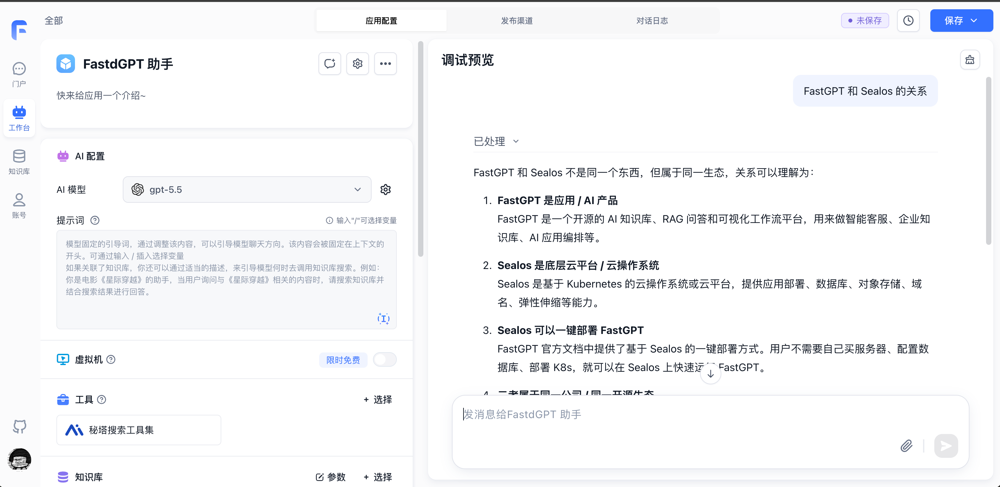
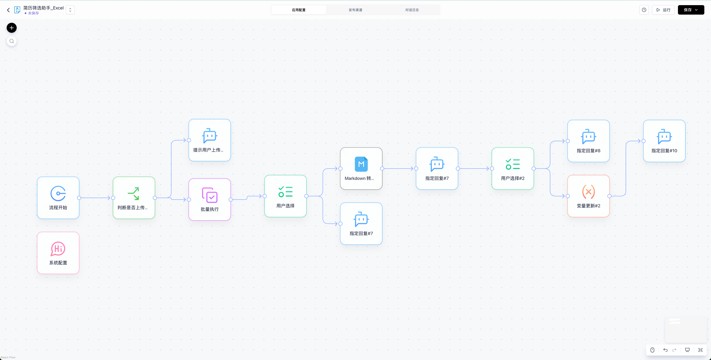
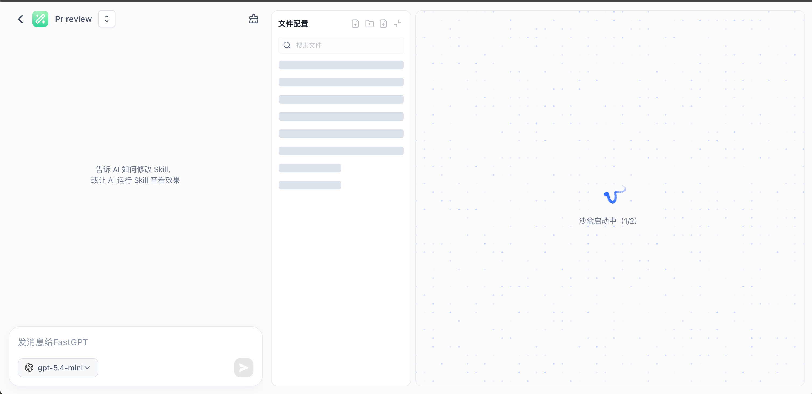
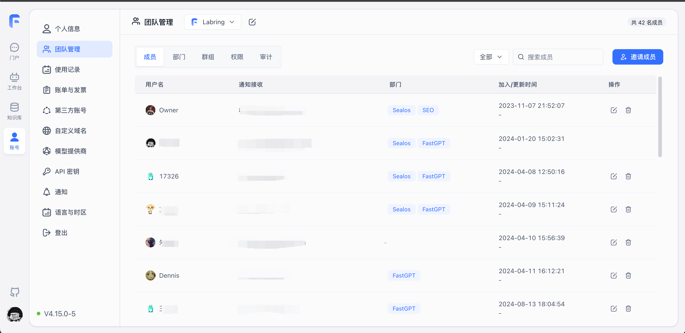

import { Alert } from '@/components/docs/Alert';

FastGPT is an AI Agent application development platform built on large language models. It combines Knowledge Base Q&A, visual Workflows, Agent orchestration, tool calling, and skill extensions so developers and business users can quickly build custom AI applications.

<Alert icon="🤖" context="success">

Try FastGPT now

- International: [https://fastgpt.io/?utm_source=docs&utm_medium=referral&utm_campaign=docs_home](https://fastgpt.io/?utm_source=docs&utm_medium=referral&utm_campaign=docs_home)
- China Mainland: [https://fastgpt.cn/?utm_source=docs&utm_medium=referral&utm_campaign=docs_home](https://fastgpt.cn/?utm_source=docs&utm_medium=referral&utm_campaign=docs_home)

</Alert>

|                                                |                                                |
| ---------------------------------------------- | ---------------------------------------------- |
|  |  |
|  |  |

## Why FastGPT

### 1. Simple and Flexible, Like Building Blocks 🧱

Build AI applications as easily as snapping LEGO bricks together. FastGPT provides rich functional modules that let you create personalized AI apps through simple drag-and-drop — no coding required, even for complex business processes.

### 2. Make Your Data Smarter 🧠

FastGPT provides a complete data intelligence solution — from data import and preprocessing to knowledge matching and intelligent Q&A — fully automated. Combined with visual workflow design, you can easily build professional-grade AI applications.

### 3. Open Source and Easy to Integrate 🔗

FastGPT supports custom development. Integrate quickly through standard APIs without modifying source code. It supports mainstream models including ChatGPT, Claude, DeepSeek, and ERNIE Bot, with continuous iteration to keep the product evolving.

---

## What Can FastGPT Do

### 1. Comprehensive Knowledge Base

Import documents and data with automatic knowledge structuring. Features intelligent Q&A with multi-turn context understanding and a continuously improving knowledge base management experience.

### 2. Visual Workflow

FastGPT's intuitive drag-and-drop interface lets you build complex business processes with zero code. Rich functional node components handle diverse business needs with flexible process orchestration.

### 3. Intelligent Data Parsing

FastGPT's knowledge base system handles imported data with great flexibility — intelligently processing complex PDF structures while preserving images, tables, and LaTeX formulas. It automatically recognizes scanned files and structures content into clean Markdown format. It also supports automatic image annotation and indexing, making visual content searchable and ensuring knowledge is presented accurately in AI Q&A.

### 4. Workflow Orchestration

Flow-based workflow orchestration lets you design complex Q&A processes — such as querying databases, checking inventory, or booking lab resources.

### 5. Powerful API Integration

FastGPT is fully compatible with the OpenAI API interface, supporting one-click integration with WeCom, WeChat Official Account, Lark, DingTalk, and more — bringing AI capabilities into your business workflows.

---

## Core Features

- Out-of-the-box knowledge base system
- Visual low-code workflow orchestration
- Support for mainstream LLMs
- Simple and easy-to-use API interface
- Flexible data processing capabilities

---

## Knowledge Base Core Process Diagram

---

## Community

FastGPT is an open source project driven by users and contributors. If you have questions or suggestions, try the following support channels. Our team and community will do our best to help.

- 📱 Scan to join the Lark community group 👇

  

- 🐞 Submit any FastGPT bugs, issues, or feature requests to [GitHub Issues](https://github.com/labring/fastgpt/issues/new/choose).
