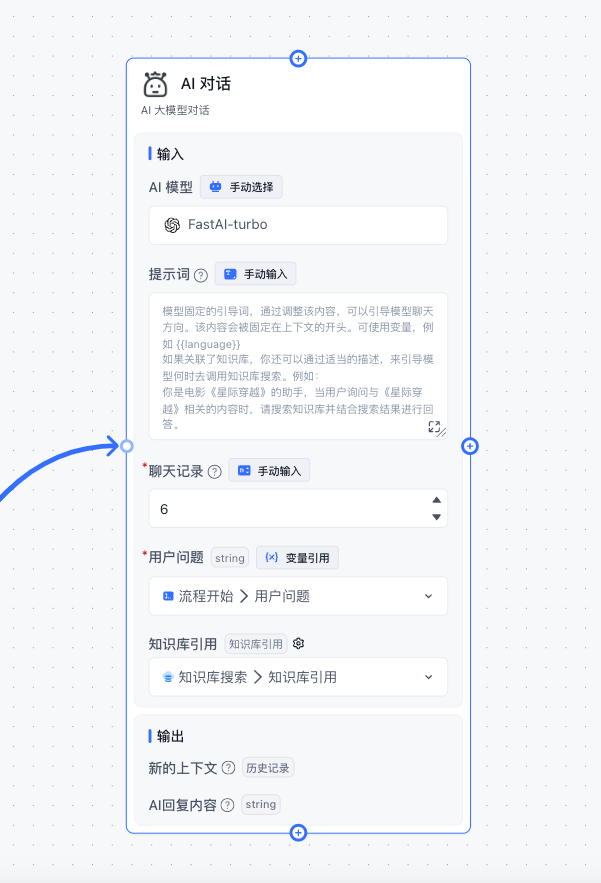
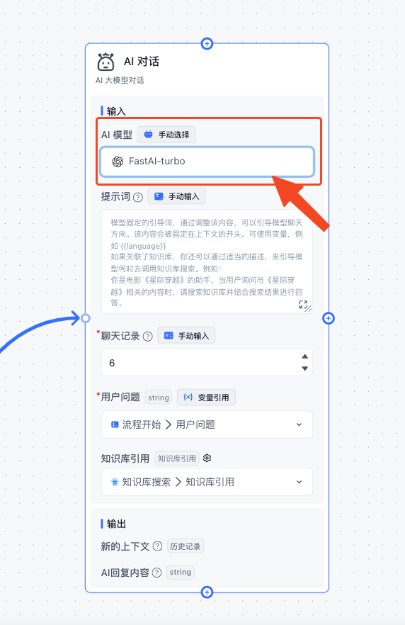
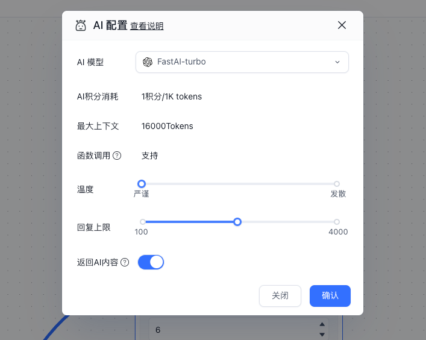

import { Alert } from '@/components/docs/Alert';

## Characteristics

- Can be added multiple times
- Trigger-based execution
- Core module

## Parameters

## AI Model

Configure available chat models via [config.json](../../../../self-host/config/model/intro.en.mdx)。

Click the AI model to configure its parameters.

<Alert icon="🍅" context="success">
  For detailed parameter descriptions, see: [AI Parameter Configuration](../../course/ai_settings.en.mdx)
</Alert>
