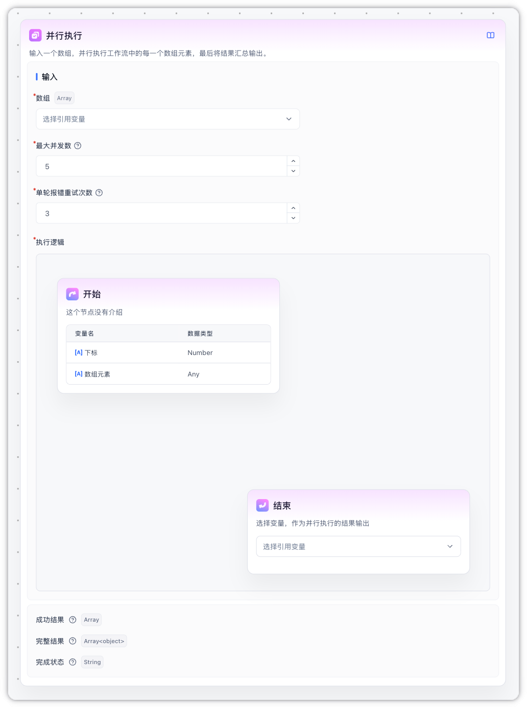
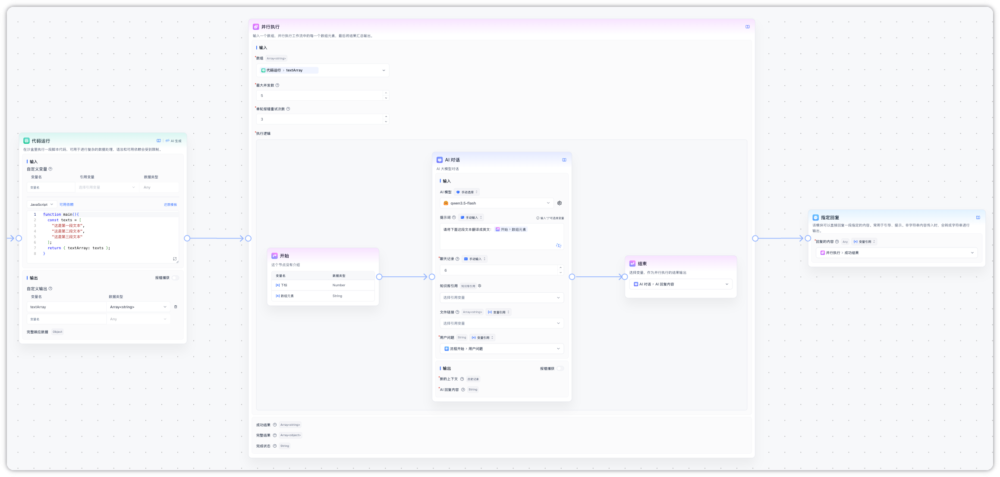
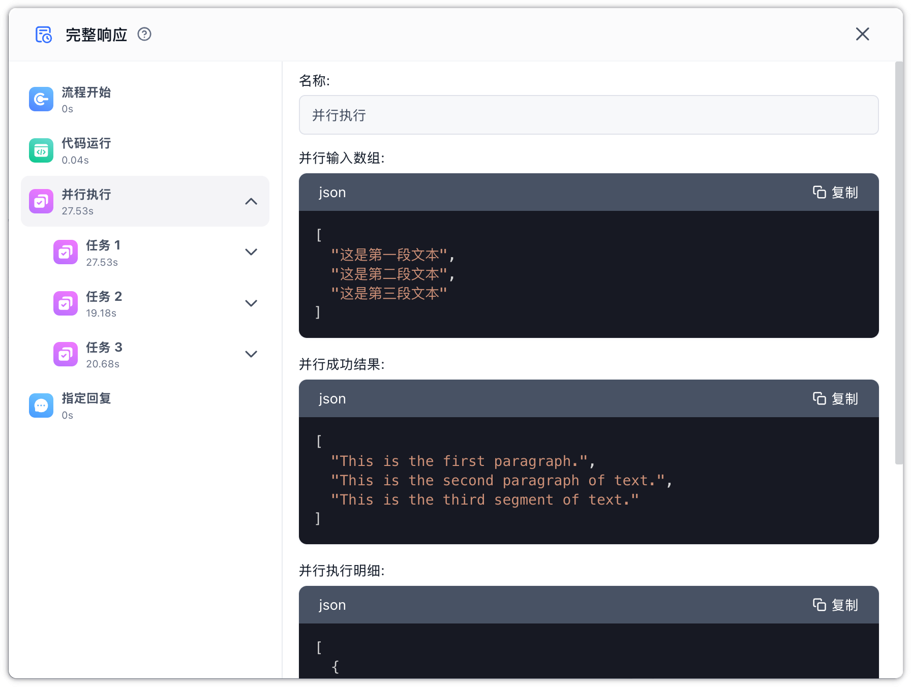

## 节点概述

【**并行执行**】节点接收一个数组，对每个元素**同时**执行同一段子工作流，最后把所有结果汇总输出。



适合那些**每一项都可以独立完成、互不依赖**的批量任务，比如：

- 同时翻译一批文本片段
- 同时抓取多个网页并提取信息
- 批量调用外部接口

## 核心特性

1. **同时处理，更快完成**
   - 多个任务一起跑，不用一个一个排队
   - 可以设置「最多几个同时跑」，平衡速度与资源消耗

2. **单个失败不影响整体**
   - 某个任务失败不会中断其他任务
   - 失败会自动重试，重试次数可自定义
   - 最后把成功和失败的结果分别归总，方便下游处理

3. **结果按任务折叠展示**
   - 运行完成后，可以在调试面板按任务单独查看每一项的执行过程
   - 不用在一堆节点里翻找某一项的执行细节

## 参数说明

### 输入

| 参数             | 必填 | 默认 | 说明                                                                                    |
| ---------------- | ---- | ---- | --------------------------------------------------------------------------------------- |
| 数组             | 是   | -    | 要批量处理的数据，通常来自上游节点的数组输出，元素可以是字符串、数字、对象等            |
| 最大并发数       | 是   | 5    | 最多允许几个任务同时进行，范围 1~上限值（上限由部署方设置，默认 10）                    |
| 单轮报错重试次数 | 是   | 3    | 单个任务失败后自动重试的次数，范围 0~5；设为 0 表示失败不再重试                         |
| 执行逻辑         | 是   | -    | 节点内部要执行的子流程，由「开始」和「结束」两个固定锚点包围，中间可以自由编排其他节点  |

### 输出

| 参数     | 类型            | 说明                                                                                                                                                    |
| -------- | --------------- | ------------------------------------------------------------------------------------------------------------------------------------------------------- |
| 成功结果 | `Array<any>`    | 只包含执行成功的任务输出，按输入顺序排列；失败的那些会被过滤掉。**下游通常用这个字段**                                                                  |
| 完整结果 | `Array<object>` | 与输入数组**一一对应**，每项形如 `{ success, message, data }`。成功时 `success=true`、`data` 是输出值；失败时 `success=false`、`message` 是错误提示、`data` 为 `null` |
| 完成状态 | `string`        | 整体状态：`success`（全部成功）、`partial_success`（部分失败）、`failed`（全部失败），可用于分支判断                                                    |

## 注意事项

- **不能嵌套**：并行执行节点里不能再放另一个【并行执行】或【批量运行】节点
- **不支持交互节点**：表单输入、用户选择等需要和用户互动的节点不能放在执行逻辑内，编辑器会阻止拖入
- **变量独立**：执行逻辑内对全局变量的修改不会带回主流程，想要保留的结果请通过「结束」节点输出
- **数组长度**：输入数组最多 100 项（由部署方统一设置，可通过下文环境变量调整）
- **尽量关闭 AI 节点的流式输出**：执行逻辑内的【AI 对话】等节点建议关闭「返回 AI 内容」（流式输出），否则多个任务的输出会同时往对话窗口里推送，容易出现内容交错、显示混乱。通常只在并行节点**之后**的【指定回复】节点里统一输出汇总结果即可。

### 部署参数

以下两个环境变量在私有化部署时可以按需调整：

| 环境变量                            | 默认值 | 说明                                                     |
| ----------------------------------- | ------ | -------------------------------------------------------- |
| `WORKFLOW_MAX_LOOP_TIMES`           | 100    | 输入数组的最大长度（【批量运行】和【并行执行】共用）     |
| `WORKFLOW_PARALLEL_MAX_CONCURRENCY` | 10     | 最大并发数的上限值，不能超过 `WORKFLOW_MAX_LOOP_TIMES` |

## 场景示例：并行翻译文本数组

假设我们要把一组文本片段并行翻译成英文，下面是最简流程。


#### 实现步骤

1. 准备输入数组

   使用【代码运行】节点构造测试数组：

   ```javascript
   function main(){
     const texts = [
       "这是第一段文本",
       "这是第二段文本",
       "这是第三段文本"
     ];
     return { textArray: texts };
   }
   ```

2. 配置并行执行节点

   - **数组输入**：选择上一步【代码运行】节点的输出变量 `textArray`
   - **最大并发数**：保持默认 `5`（数组只有 3 项，实际会同时跑 3 个任务）
   - **单轮报错重试次数**：保持默认 `3`
   - 在执行逻辑内添加一个【AI 对话】节点，引用「开始」节点的输入作为待翻译文本，prompt 设为：`请将下面这段文本翻译成英文：{当前数组项}`，并**关闭「返回 AI 内容」**，避免多个任务的输出交错
   - 「结束」节点选择输出变量为 AI 对话的回复内容

3. 使用结果

   - 下游引用「**成功结果**」即可拿到翻译好的字符串数组
   - 如果需要核对每一项是否成功，引用「**完整结果**」查看每项的状态
   - 通过「**完成状态**」可以快速判断是否需要走兜底逻辑（例如全部失败时发送告警）

#### 执行流程



1. 【代码运行】节点生成 3 段文本
2. 【并行执行】节点接收数组，3 段文本同时送入 AI 翻译
3. 任一翻译失败会自动重试，仍失败的项会在「完整结果」中标记为失败
4. 所有任务完成后，节点一次性输出「成功结果」「完整结果」「完成状态」
