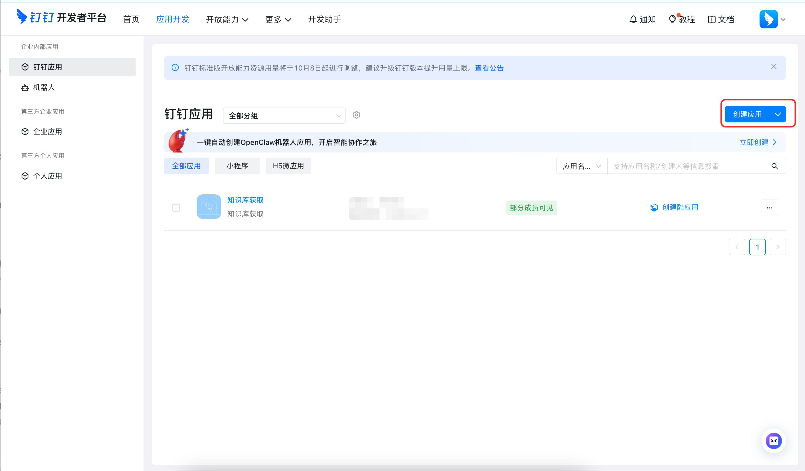
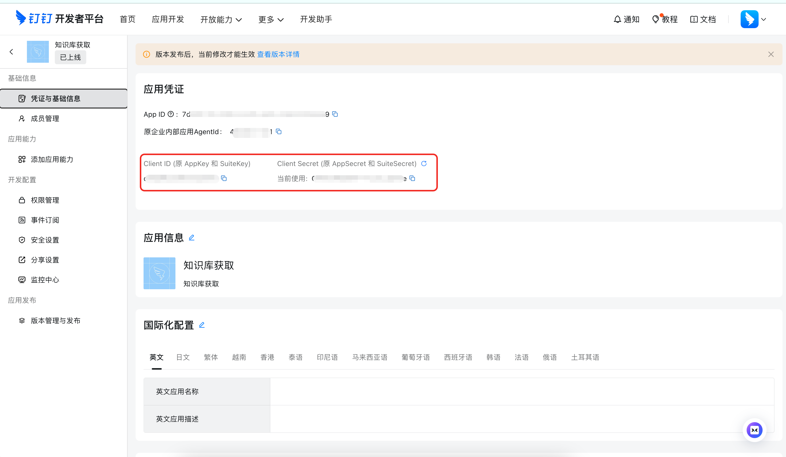
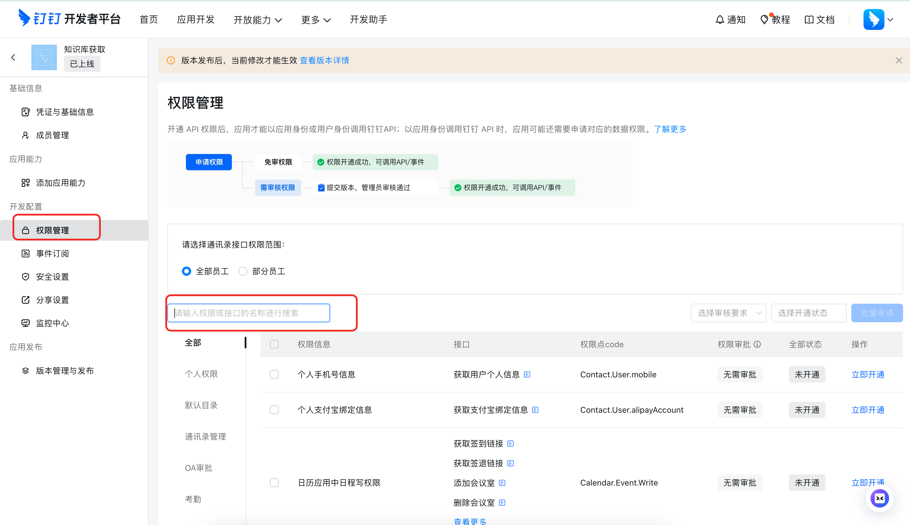

FastGPT supports connecting DingTalk Knowledge Base through a DingTalk internal enterprise app. When creating the dataset, enter `App Key`, `App Secret`, and `User ID`. After creation, open the dataset detail page, click `Add file`, and select the DingTalk workspace, online documents, or folders to import.

Only DingTalk online document text is supported. Binary files such as PDF, Word, Excel, and PPT are not supported.

## 1. Create a DingTalk app

Open the [DingTalk developer app page](https://open-dev.dingtalk.com/fe/app?hash=%23%2Fcorp%2Fapp#/corp/app), then select an internal enterprise app under the target organization.

If you do not have an app yet, create an internal enterprise app from `Application Development`.

## 2. Get the FastGPT fields

| FastGPT field | Where to get it in DingTalk |
| --- | --- |
| `App Key` | Open `Credentials and Basic Information` in the app detail page, then copy `Client ID (formerly AppKey and SuiteKey)`. |
| `App Secret` | Copy `Client Secret (formerly AppSecret and SuiteSecret)` from the same page. |
| `User ID` | Ask the organization contact administrator to open DingTalk admin. Path: [oa.dingtalk.com](https://oa.dingtalk.com/) -> `Contacts` -> `Member Management` -> select the operator member -> copy the member `User ID` from the detail page. |

Notes:

- `App Secret` is sensitive. Do not share it publicly.
- `User ID` is not a phone number, display name, or `unionId`.
- If the member detail page does not show `User ID`, ask the contact administrator to export the member list from `Contacts`; the exported sheet usually contains member `User ID`.
- We recommend using a dedicated DingTalk member as the FastGPT sync account and granting it read-only access to the target workspace.
- Workspaces that this member cannot access will not appear in FastGPT.

## 3. Enable DingTalk app permissions

Open `Permissions` in the DingTalk app detail page, then search for and enable:

| Permission | Purpose |
| --- | --- |
| `qyapi_get_member` | Get the operator ID from `User ID`. |
| `Wiki.Workspace.Read` | List DingTalk workspaces accessible to the operator. |
| `Wiki.Node.Read` | List folders and documents under a workspace. |
| `Storage.File.Read` | Read DingTalk online document content. |

Save and publish the app configuration after enabling permissions. If an error contains `requiredScopes`, enable the permissions listed there.

## 4. Create a DingTalk dataset in FastGPT

1. Open the FastGPT dataset list and click `New`.
2. Select `DingTalk Knowledge Base` under external document sources.
3. Enter:
   - `App Key`
   - `App Secret`
   - `User ID`
4. Confirm creation.

You do not need to select a DingTalk workspace or root directory during creation.

## 5. Add files and sync

After creation:

1. Open the dataset detail page.
2. Click `Add file`.
3. Select the target DingTalk workspace.
4. Select online documents or folders to import.
5. Confirm the import.

When a folder is selected, FastGPT recursively imports supported online documents under that folder.

When DingTalk document content changes, click `Sync` from the imported file menu. FastGPT will read the latest content and update indexes.
