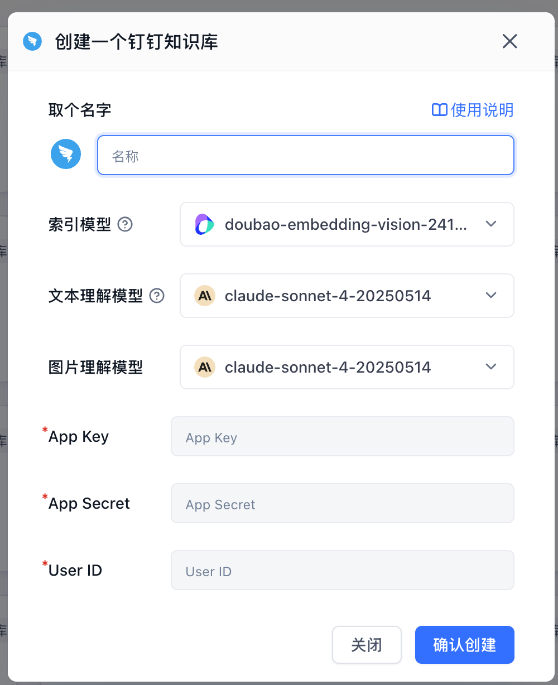
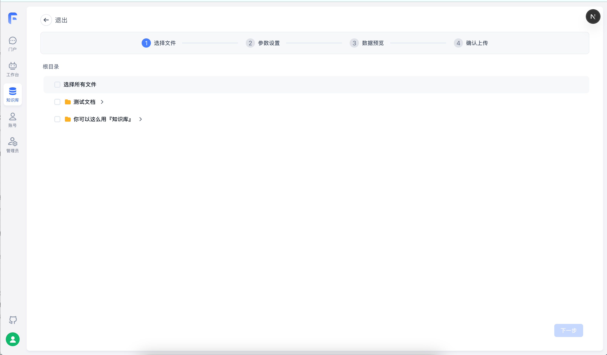

|                                                                                                         |                                                                                                         |
| ------------------------------------------------------------------------------------------------------- | ------------------------------------------------------------------------------------------------------- |
|  |  |

FastGPT 支持通过钉钉企业内部应用接入钉钉知识库。创建时只需要填写 `App Key`、`App Secret`、`User ID`，创建完成后进入知识库详情页点击`添加文件`，再选择要导入的钉钉知识库、在线文档或文件夹。

当前仅支持钉钉在线文档文本，不支持 PDF、Word、Excel、PPT 等二进制文件。

## 1. 创建钉钉应用

打开 [钉钉开发者后台应用详情](https://open-dev.dingtalk.com/fe/app?hash=%23%2Fcorp%2Fapp#/corp/app)，选择目标企业下的企业内部应用。

如果还没有应用，先进入`应用开发`创建一个企业内部应用。

## 2. 获取 FastGPT 要填写的参数

| FastGPT 字段 | 钉钉里去哪里拿 |
| --- | --- |
| `App Key` | 应用详情页左侧进入`凭证与基础信息`，复制`Client ID（原 AppKey 和 SuiteKey）`。 |
| `App Secret` | 同一页面复制`Client Secret（原 AppSecret 和 SuiteSecret）`。 |
| `User ID` | 由企业通讯录管理员进入钉钉管理后台查看。路径：[oa.dingtalk.com](https://oa.dingtalk.com/) -> `通讯录` -> `成员管理` -> 找到作为操作人的成员 -> 点击成员详情，复制该成员的 `User ID`。 |

注意：

- `App Secret` 是密钥，不要公开发送。
- `User ID` 不是手机号、姓名，也不是 `unionId`。
- 如果成员详情页没有展示 `User ID`，让通讯录管理员在`通讯录`里导出成员列表，导出的表格中通常包含成员 `User ID`。
- 建议使用一个专门的钉钉成员作为 FastGPT 同步账号，并给它目标知识库的只读权限。
- 该成员没有权限访问的钉钉知识库，不会出现在 FastGPT 的添加文件列表里。

## 3. 配置钉钉应用权限

在钉钉应用详情页左侧进入`权限管理`，搜索并开通以下权限：

| 权限标识 | 用途 |
| --- | --- |
| `qyapi_get_member` | 通过 `User ID` 获取接口需要的操作人 ID。 |
| `Wiki.Workspace.Read` | 获取当前操作人可访问的钉钉知识库列表。 |
| `Wiki.Node.Read` | 获取知识库下的文件夹和文档列表。 |
| `Storage.File.Read` | 读取钉钉在线文档正文。 |

权限配置完成后，保存并发布应用配置。若接口报错中出现 `requiredScopes`，按提示补开对应权限。

## 4. 在 FastGPT 中创建钉钉知识库

1. 进入 FastGPT 知识库列表，点击`新建`。
2. 选择`第三方知识库`下的`钉钉知识库`。
3. 填写：
   - `App Key`
   - `App Secret`
   - `User ID`
4. 点击确认创建。

## 5. 添加文件和同步

创建完成后：

1. 进入该知识库详情页。
2. 右上角点击`添加文件`。
3. 选择目标钉钉知识库。
4. 选择要导入的在线文档或文件夹。
5. 确认导入。

选择文件夹时，FastGPT 会递归导入该文件夹下支持的在线文档。

钉钉文档内容更新后，可在已导入文件的更多菜单中点击`同步`，FastGPT 会重新读取最新正文并更新索引。
