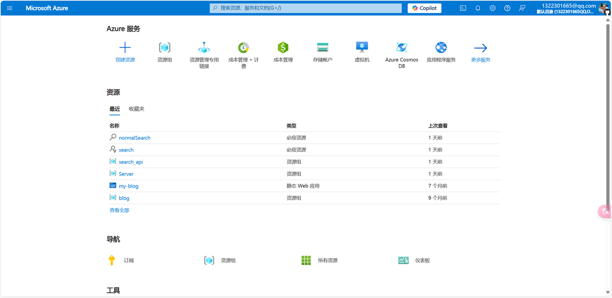
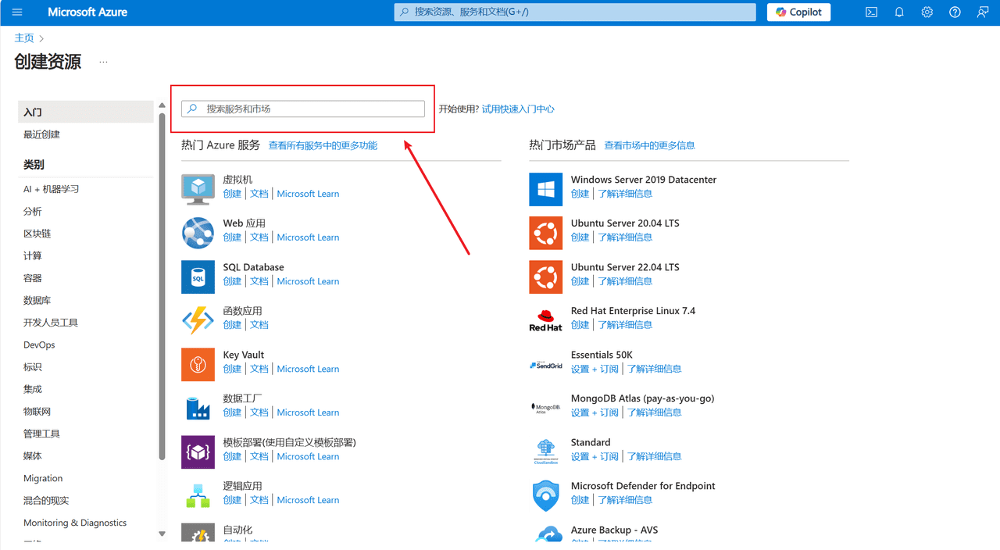
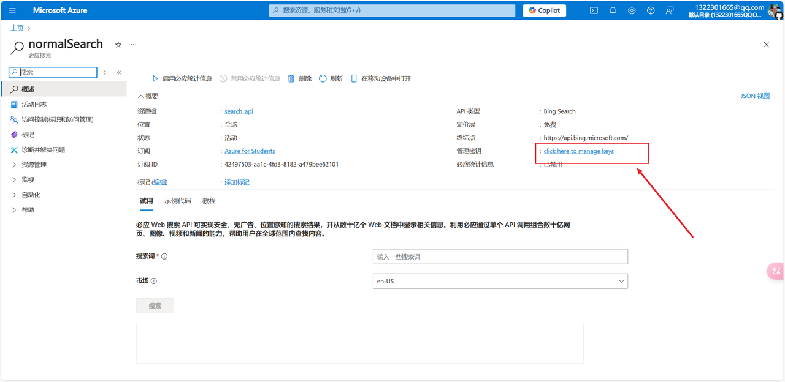
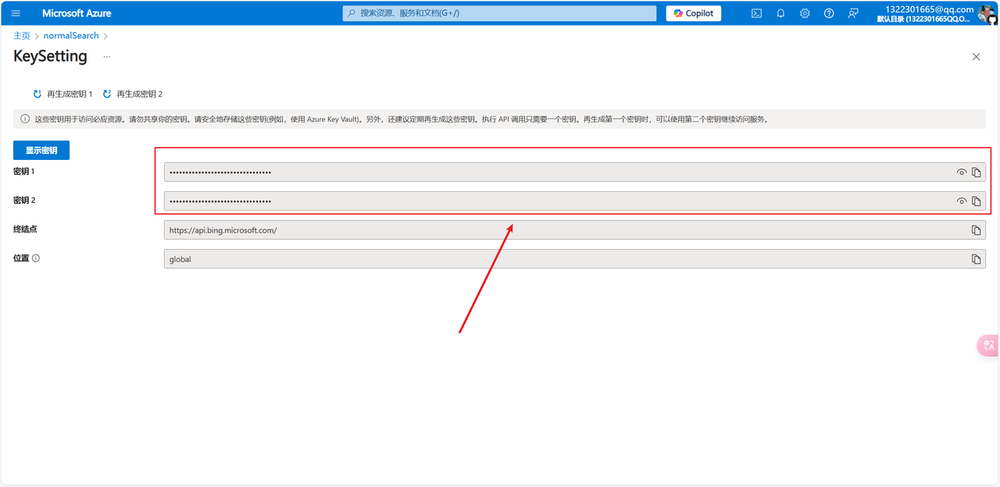
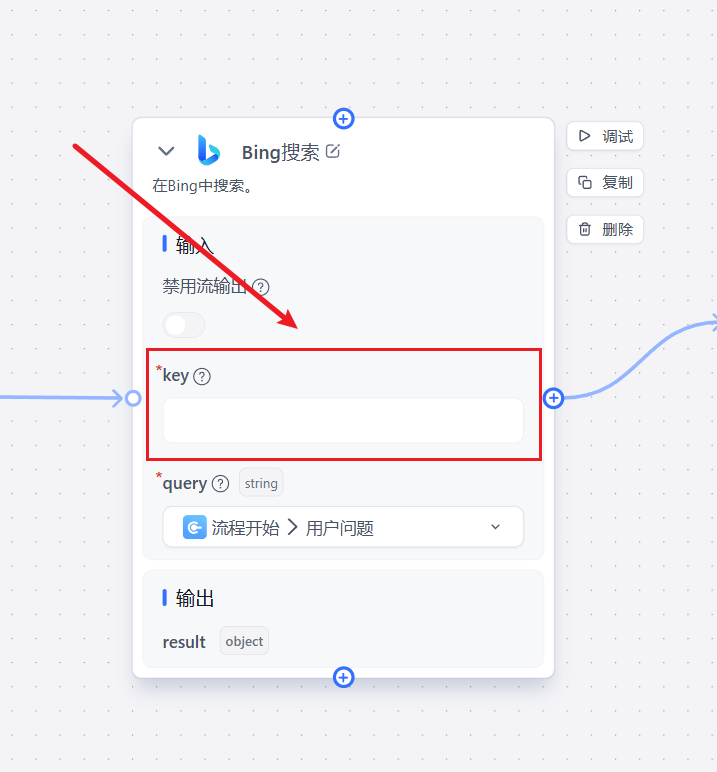

1. # Open the Microsoft Azure Portal and Log In

https://portal.azure.com/

2. # Create a Bing Web Search Resource

Search for Bing Search v7 and click Create.

https://portal.azure.com/#create/Microsoft.BingSearch

3. # Go to the Resource Details and Click Manage Keys

# 4. Copy Either Key and Paste It into the Plugin Input

