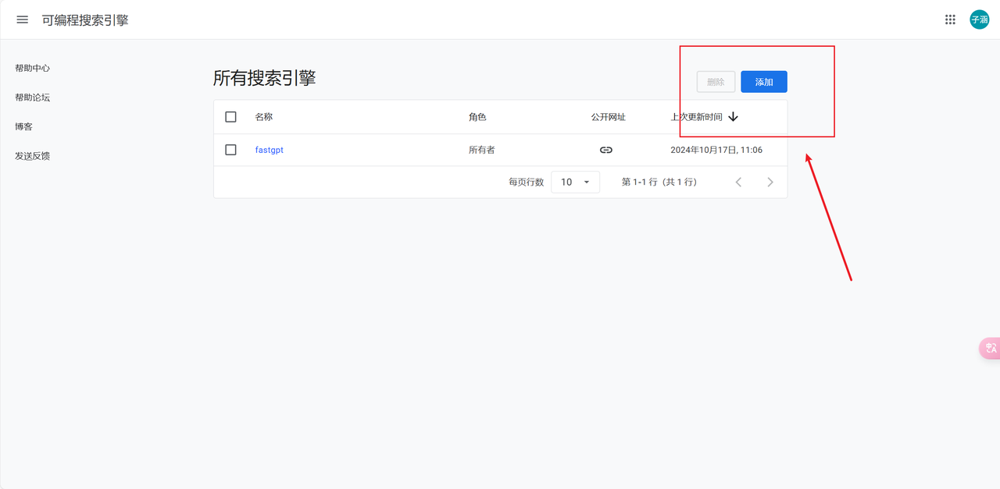
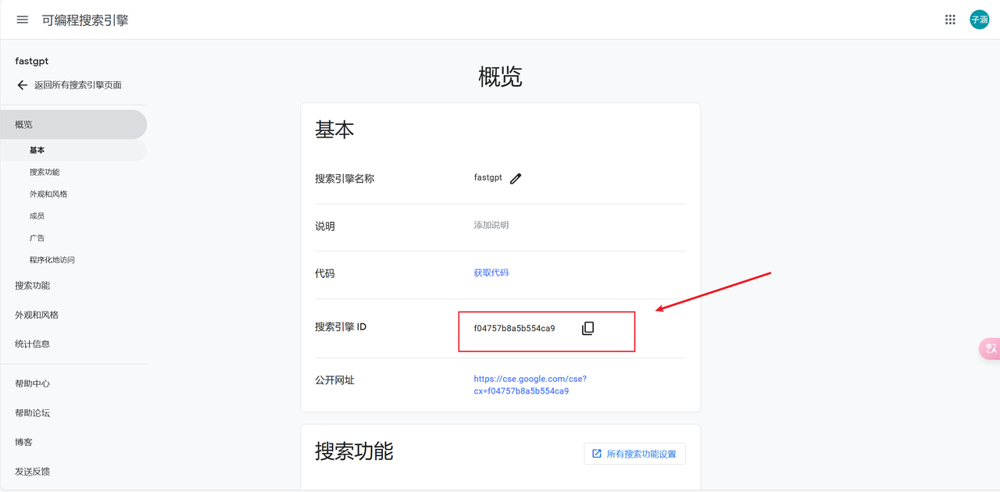
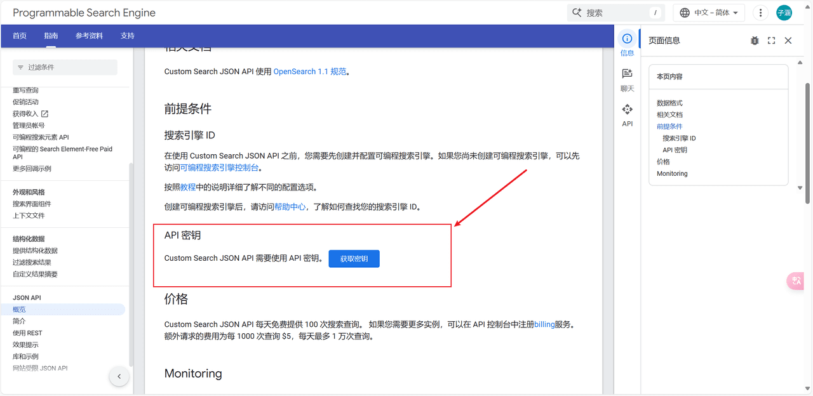
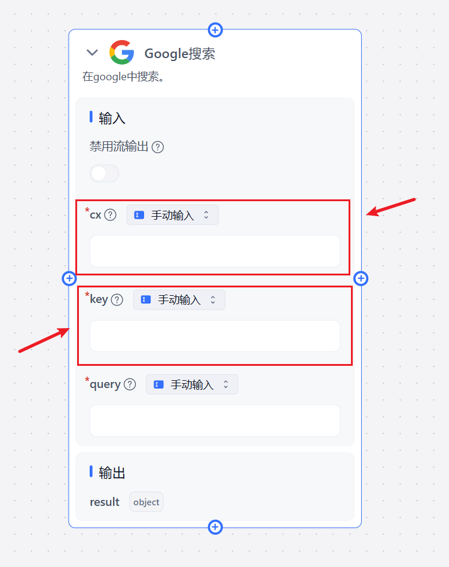

## 1. Create a Google Custom Search Engine

https://programmablesearchengine.google.com/

Go to the Custom Search Engine control panel and create a new Search Engine.

Get the Search Engine ID (cx).

## 2. Get an API Key

https://developers.google.com/custom-search/v1/overview

## 3. Fill in the Plugin Input Parameters

Enter the Search Engine ID in the cx field and the API key in the key field.

