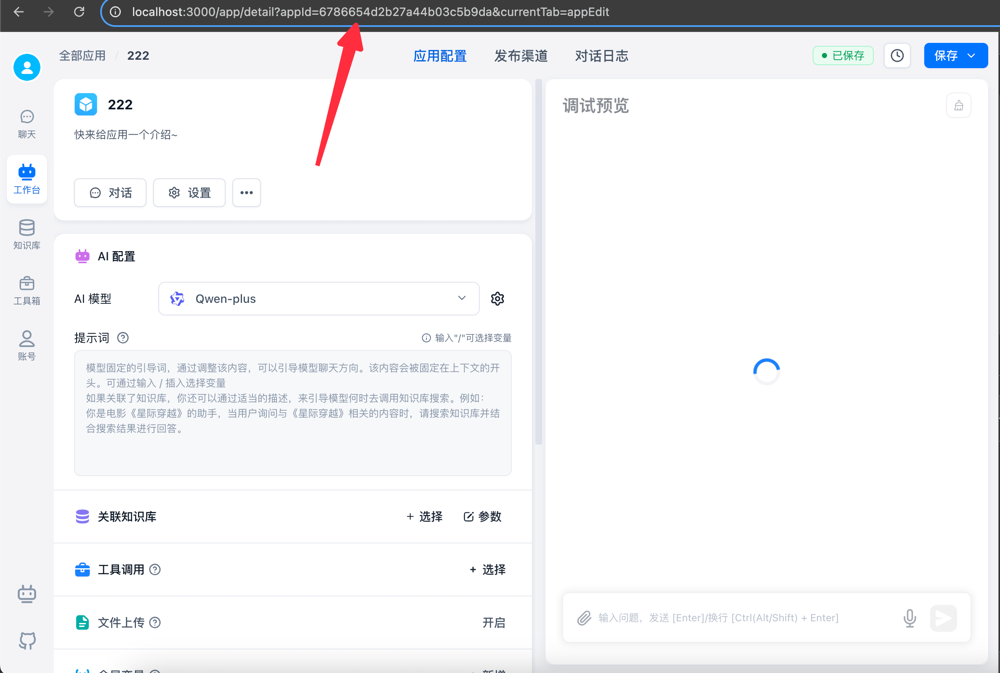

# How to Get AppId

You can find the AppId in your application details URL.



# Start a Conversation

- This API requires an application-specific API key, or it will return an error.
- Some packages require adding the `v1` path to the `BaseUrl` value. If you get a 404 error, add `v1` and retry.

{/* * The chat API currently provides both `v1` and `v2`. Use whichever fits your needs. `v2` was added in v4.9.4, and `v1` is no longer maintained. */}

## Call a Chat Agent or Workflow

The `v1` chat API is compatible with the `GPT` API. If your project already uses the standard official `GPT` API, you can call a FastGPT app by changing the `BaseUrl` value and `Authorization` header. Keep these rules in mind:

* Parameters such as `model` and `temperature` are ignored. These values are controlled by the workflow configuration and will not change based on API parameters.
* The API does not return actual token usage. If you need it, set `detail=true` and calculate the `tokens` values in the `responseData` payload.

### Request

<Tabs items={["Basic Request Example","Image/File Request Example","Parameters"]}>

  <Tab value="Basic Request Example">

  ```bash
  curl --location --request POST 'http://localhost:3000/api/v1/chat/completions' \
  --header 'Authorization: Bearer fastgpt-xxxxxx' \
  --header 'Content-Type: application/json' \
  --data-raw '{
  "chatId": "my_chatId",
  "stream": false,
  "detail": false,
  "responseChatItemId": "my_responseChatItemId",
  "variables": {
      "uid": "asdfadsfasfd2323",
      "name": "张三"
  },
  "messages": [
      {
          "role": "user",
          "content": "导演是谁"
      }
  ]
  }'
  ```

  </Tab>

  <Tab value="Image/File Request Example">

  - Only `messages` differs slightly; other parameters are the same.
  - Direct file uploads are not supported. Upload files to your object storage and provide the URL.

  ```bash
  curl --location --request POST 'http://localhost:3000/api/v1/chat/completions' \
  --header 'Authorization: Bearer fastgpt-xxxxxx' \
  --header 'Content-Type: application/json' \
  --data-raw '{
      "chatId": "abcd",
      "stream": false,
      "messages": [
          {
              "role": "user",
              "content": [
                  {
                      "type": "text",
                      "text": "导演是谁"
                  },
                  {
                      "type": "image_url",
                      "image_url": {
                          "url": "图片链接"
                      }
                  },
                  {
                      "type": "file_url",
                      "name": "文件名",
                      "url": "文档链接，支持 txt md html word pdf ppt csv excel"
                  }
              ]
          }
      ]
  }'
  ```

  </Tab>

  <Tab value="Parameters">

<div>
- headers.Authorization: Bearer [apikey]
- chatId: string | undefined.
  - Empty or omitted: FastGPT context is not used. The context is built entirely from the provided `messages` array.
  - Non-empty string: FastGPT uses `chatId` to continue the conversation, automatically loads history from the database, and uses only the last item in the `messages` array as the user's question. Other messages are ignored. Make sure `chatId` is unique and shorter than 250 characters. It is usually the conversation ID from your own system.
- messages: Same structure as OpenAI's [chat message object](https://platform.openai.com/docs/api-reference/chat/object) format.
- responseChatItemId: string | undefined. If provided, FastGPT uses it as the response message ID for this conversation and stores it in the database. Make sure `responseChatItemId` is unique within the current `chatId` scope.
- authProxy: object | undefined. API Key auth only. Specifies which team member this request runs as. Supports the `username` field or the `tmbId` field; when both values are provided, they must resolve to the same member. When continuing a conversation with the `chatId` value, that member must own the chat. (v4.15.0 feature)
- detail: Whether to return intermediate values, such as node status and full node responses. In `stream` mode, payloads are separated by event names. In non-stream mode, results are stored in the `responseData` payload.
- variables: Module variables. This object replaces `[key]` placeholders in module input fields.
</div>

  </Tab>
</Tabs>

### Response

<Tabs items={['detail=false, stream=false Response','detail=false, stream=true Response','detail=true, stream=false Response','detail=true, stream=true Response','Event Values']}>
  <Tab value="detail=false, stream=false Response">

```json
{
  "id": "adsfasf",
  "model": "",
  "usage": {
    "prompt_tokens": 1,
    "completion_tokens": 1,
    "total_tokens": 1
  },
  "choices": [
    {
      "message": {
        "role": "assistant",
        "content": "电影《铃芽之旅》的导演是新海诚。"
      },
      "finish_reason": "stop",
      "index": 0
    }
  ]
}
```

  </Tab>
  <Tab value="detail=false, stream=true Response">

```bash
data: {"id":"","object":"","created":0,"choices":[{"delta":{"content":""},"index":0,"finish_reason":null}]}

data: {"id":"","object":"","created":0,"choices":[{"delta":{"content":"电"},"index":0,"finish_reason":null}]}

data: {"id":"","object":"","created":0,"choices":[{"delta":{"content":"影"},"index":0,"finish_reason":null}]}

data: {"id":"","object":"","created":0,"choices":[{"delta":{"content":"《"},"index":0,"finish_reason":null}]}
```

  </Tab>
  <Tab value="detail=true, stream=false Response">

```json
{
  "responseData": [
    // Response values from different nodes. Values may vary by version. Log the response first to inspect the latest shape.
    {
      "moduleName": "Dataset Search",
      "price": 1.2000000000000002,
      "model": "Embedding-2",
      "tokens": 6,
      "similarity": 0.61,
      "limit": 3
    },
    {
      "moduleName": "AI Chat",
      "price": 454.5,
      "model": "FastAI-4k",
      "tokens": 303,
      "question": "导演是谁",
      "answer": "电影《铃芽之旅》的导演是新海诚。",
      "maxToken": 2050,
      "quoteList": [
        {
          "dataset_id": "646627f4f7b896cfd8910e38",
          "id": "8099",
          "q": "本作的主人公是谁？",
          "a": "本作的主人公是名叫铃芽的少女。",
          "source": "手动修改"
        },
        {
          "dataset_id": "646627f4f7b896cfd8910e38",
          "id": "8686",
          "q": "电影《铃芽之旅》男主角是谁？",
          "a": "电影《铃芽之旅》男主角是宗像草太，由松村北斗配音。",
          "source": ""
        },
        {
          "dataset_id": "646627f4f7b896cfd8910e38",
          "id": "19339",
          "q": "电影《铃芽之旅》的导演是谁？22",
          "a": "电影《铃芽之旅》的导演是新海诚。",
          "source": "手动修改"
        }
      ],
      "completeMessages": [
        {
          "obj": "System",
          "value": "下面是知识库内容:\n1. [本作的主人公是谁？\n本作的主人公是名叫铃芽的少女。]\n2. [电影《铃芽之旅》男主角是谁？\n电影《铃芽之旅》男主角是宗像草太，由松村北斗配音。]\n3. [电影《铃芽之旅》的导演是谁？22\n电影《铃芽之旅》的导演是新海诚。]\n"
        },
        {
          "obj": "System",
          "value": "1.请记住，你的身份是百度的下一代知识增强语言模型，能够完全根据知识库提供的内容回答问题。\n\n2. 你忘记了关于电影《铃芽之旅》以外的内容。"
        },
        {
          "obj": "System",
          "value": "你仅回答关于电影《玲芽之旅》的问题，其余问题直接回复: 我不清楚。"
        },
        {
          "obj": "Human",
          "value": "导演是谁"
        },
        {
          "obj": "AI",
          "value": "电影《铃芽之旅》的导演是新海诚。"
        }
      ]
    }
  ],
  "id": "",
  "model": "",
  "usage": {
    "prompt_tokens": 1,
    "completion_tokens": 1,
    "total_tokens": 1
  },
  "choices": [
    {
      "message": {
        "role": "assistant",
        "content": "电影《铃芽之旅》的导演是新海诚。"
      },
      "finish_reason": "stop",
      "index": 0
    }
  ]
}
```

  </Tab>
  <Tab value="detail=true, stream=true Response">

```bash
event: flowNodeStatus
data: {"status":"running","name":"知识库搜索"}

event: flowNodeStatus
data: {"status":"running","name":"AI 对话"}

event: answer
data: {"id":"","object":"","created":0,"model":"","choices":[{"delta":{"content":"电影"},"index":0,"finish_reason":null}]}

event: answer
data: {"id":"","object":"","created":0,"model":"","choices":[{"delta":{"content":"《铃"},"index":0,"finish_reason":null}]}

event: answer
data: {"id":"","object":"","created":0,"model":"","choices":[{"delta":{"content":"芽之旅》"},"index":0,"finish_reason":null}]}

event: answer
data: {"id":"","object":"","created":0,"model":"","choices":[{"delta":{"content":"的导演是新"},"index":0,"finish_reason":null}]}

event: answer
data: {"id":"","object":"","created":0,"model":"","choices":[{"delta":{"content":"海诚。"},"index":0,"finish_reason":null}]}

event: answer
data: {"id":"","object":"","created":0,"model":"","choices":[{"delta":{},"index":0,"finish_reason":"stop"}]}

event: answer
data: [DONE]

event: flowResponses
data: [{"moduleName":"知识库搜索","moduleType":"datasetSearchNode","runningTime":1.78},{"question":"导演是谁","quoteList":[{"id":"654f2e49b64caef1d9431e8b","q":"电影《铃芽之旅》的导演是谁？","a":"电影《铃芽之旅》的导演是新海诚!","indexes":[{"type":"qa","dataId":"3515487","text":"电影《铃芽之旅》的导演是谁？","_id":"654f2e49b64caef1d9431e8c","defaultIndex":true}],"datasetId":"646627f4f7b896cfd8910e38","collectionId":"653279b16cd42ab509e766e8","sourceName":"data (81).csv","sourceId":"64fd3b6423aa1307b65896f6","score":0.8935586214065552},{"id":"6552e14c50f4a2a8e632af11","q":"导演是谁？","a":"电影《铃芽之旅》的导演是新海诚。","indexes":[{"defaultIndex":true,"type":"qa","dataId":"3644565","text":"导演是谁？\n电影《铃芽之旅》的导演是新海诚。","_id":"6552e14dde5cc7ba3954e417"}],"datasetId":"646627f4f7b896cfd8910e38","collectionId":"653279b16cd42ab509e766e8","sourceName":"data (81).csv","sourceId":"64fd3b6423aa1307b65896f6","score":0.8890955448150635},{"id":"654f34a0b64caef1d946337e","q":"本作的主人公是谁？","a":"本作的主人公是名叫铃芽的少女。","indexes":[{"type":"qa","dataId":"3515541","text":"本作的主人公是谁？","_id":"654f34a0b64caef1d946337f","defaultIndex":true}],"datasetId":"646627f4f7b896cfd8910e38","collectionId":"653279b16cd42ab509e766e8","sourceName":"data (81).csv","sourceId":"64fd3b6423aa1307b65896f6","score":0.8738770484924316},{"id":"654f3002b64caef1d944207a","q":"电影《铃芽之旅》男主角是谁？","a":"电影《铃芽之旅》男主角是宗像草太，由松村北斗配音。","indexes":[{"type":"qa","dataId":"3515538","text":"电影《铃芽之旅》男主角是谁？","_id":"654f3002b64caef1d944207b","defaultIndex":true}],"datasetId":"646627f4f7b896cfd8910e38","collectionId":"653279b16cd42ab509e766e8","sourceName":"data (81).csv","sourceId":"64fd3b6423aa1307b65896f6","score":0.8607980012893677},{"id":"654f2fc8b64caef1d943fd46","q":"电影《铃芽之旅》的编剧是谁？","a":"新海诚是本片的编剧。","indexes":[{"defaultIndex":true,"type":"qa","dataId":"3515550","text":"电影《铃芽之旅》的编剧是谁？22","_id":"654f2fc8b64caef1d943fd47"}],"datasetId":"646627f4f7b896cfd8910e38","collectionId":"653279b16cd42ab509e766e8","sourceName":"data (81).csv","sourceId":"64fd3b6423aa1307b65896f6","score":0.8468944430351257}],"moduleName":"AI 对话","moduleType":"chatNode","runningTime":1.86}]
```

  </Tab>
  <Tab value="Event Values">

Event values:

    - answer: Text returned to the client. It is counted as the final answer.
    - fastAnswer: Text returned from a specified reply. It is counted as the final answer.
    - toolCall: Tool execution.
    - toolParams: Tool parameters.
    - toolResponse: Tool response.
    - flowNodeStatus: Status of the node currently running.
    - flowResponses: Full node responses.
    - updateVariables: Updated variables.
    - error: Error.

  </Tab>
</Tabs>

### Interactive Node Response

If your workflow contains interactive nodes, call this API with detail set to true. You can get the interactive node configuration from `event=interactive` data. When streaming is disabled, read the `type=interactive` element from the `choices` array to get the interactive selection information.

When a workflow reaches an interactive node, the API returns immediately with information like this:

<Tabs items={['User Selection','Form Input']}>
  <Tab value="User Selection">

```json
{
  "interactive": {
    "type": "userSelect",
    "params": {
      "description": "测试",
      "userSelectOptions": [
        {
          "value": "Confirm",
          "key": "option1"
        },
        {
          "value": "Cancel",
          "key": "option2"
        }
      ]
    }
  }
}
```

  </Tab>
  <Tab value="Form Input">

```json
{
  "interactive": {
    "type": "userInput",
    "params": {
      "description": "测试",
      "inputForm": [
        {
          "type": "input",
          "key": "测试 1",
          "label": "测试 1",
          "description": "",
          "value": "",
          "defaultValue": "",
          "valueType": "string",
          "required": false,
          "list": [
            {
              "label": "",
              "value": ""
            }
          ]
        },
        {
          "type": "numberInput",
          "key": "测试 2",
          "label": "测试 2",
          "description": "",
          "value": "",
          "defaultValue": "",
          "valueType": "number",
          "required": false,
          "list": [
            {
              "label": "",
              "value": ""
            }
          ]
        }
      ]
    }
  }
}
```

  </Tab>
</Tabs>

### Continue Interactive Node

After receiving interactive node information, render your UI to guide user input or selection. Then call this API again to continue the workflow. Use this format:

<Tabs items={['User Selection','Form Input']}>
  <Tab value="User Selection">

For user selection, simply pass the selected value to messages.

```bash
curl --location --request POST 'http://localhost:3000/api/v1/chat/completions' \
--header 'Authorization: Bearer fastgpt-xxx' \
--header 'Content-Type: application/json' \
--data-raw '{
    "stream": true,
    "detail": true,
    "chatId":"22222231",
    "messages": [
        {
            "role": "user",
            "content": "Confirm"
        }
    ]
}'
```

  </Tab>
  <Tab value="Form Input">

Form input is slightly more complex. Serialize the input as a JSON string for the `messages` value. Object keys match form keys, and values are user inputs. Make sure the `chatId` value stays consistent.

```bash
curl --location --request POST 'http://localhost:3000/api/v1/chat/completions' \
--header 'Authorization: Bearer fastgpt-xxxx' \
--header 'Content-Type: application/json' \
--data-raw '{
    "stream": true,
    "detail": true,
    "chatId":"22231",
    "messages": [
        {
            "role": "user",
            "content": "{\"测试 1\":\"这是输入框的内容\",\"测试 2\":666}"
        }
    ]
}'
```

  </Tab>
</Tabs>

## Request Plugin

Plugin API is identical to chat API, with slight parameter differences:

- For plugin-type apps, the API uses `detail` mode by default.
- No need to pass `chatId` because plugins run only once.
- No need to pass the `messages` array.
- Pass `variables` to represent plugin inputs.
- Get plugin outputs from the `pluginData` value.

### Request

```bash
curl --location --request POST 'http://localhost:3000/api/v1/chat/completions' \
--header 'Authorization: Bearer test-xxxxx' \
--header 'Content-Type: application/json' \
--data-raw '{
    "stream": false,
    "chatId": "test",
    "variables": {
        "query":"你好" # My plugin input has one parameter named query.
    }
}'
```

### Response

<Tabs items={['detail=true, stream=false Response','detail=true, stream=true Response','Output Retrieval']}>
  <Tab value="detail=true, stream=false Response">

- Find plugin output by locating `moduleType=pluginOutput` entries in the `responseData` array. The `pluginOutput` field contains the output.
- Stream output is still available through the `choices` array.

```json
{
  "responseData": [
    {
      "nodeId": "fdDgXQ6SYn8v",
      "moduleName": "AI 对话",
      "moduleType": "chatNode",
      "totalPoints": 0.685,
      "model": "FastAI-3.5",
      "tokens": 685,
      "query": "你好",
      "maxToken": 2000,
      "historyPreview": [
        {
          "obj": "Human",
          "value": "你好"
        },
        {
          "obj": "AI",
          "value": "你好！有什么可以帮助你的吗？欢迎向我提问。"
        }
      ],
      "contextTotalLen": 14,
      "runningTime": 1.73
    },
    {
      "nodeId": "pluginOutput",
      "moduleName": "插件输出",
      "moduleType": "pluginOutput",
      "totalPoints": 0,
      "pluginOutput": {
        "result": "你好！有什么可以帮助你的吗？欢迎向我提问。"
      },
      "runningTime": 0
    }
  ],
  "newVariables": {
    "query": "你好"
  },
  "id": "safsafsa",
  "model": "",
  "usage": {
    "prompt_tokens": 1,
    "completion_tokens": 1,
    "total_tokens": 1
  },
  "choices": [
    {
      "message": {
        "role": "assistant",
        "content": "你好！有什么可以帮助你的吗？欢迎向我提问。"
      },
      "finish_reason": "stop",
      "index": 0
    }
  ]
}
```

  </Tab>
  <Tab value="detail=true, stream=true Response">

- Get plugin output by deserializing the `event=flowResponses` string into an array. Find `moduleType=pluginOutput` element; its `pluginOutput` contains the output.
- Stream output works the same as chat API.

```bash
event: flowNodeStatus
data: {"status":"running","name":"AI 对话"}

event: answer
data: {"id":"","object":"","created":0,"model":"","choices":[{"delta":{"role":"assistant","content":""},"index":0,"finish_reason":null}]}

event: answer
data: {"id":"","object":"","created":0,"model":"","choices":[{"delta":{"role":"assistant","content":"你"},"index":0,"finish_reason":null}]}

event: answer
data: {"id":"","object":"","created":0,"model":"","choices":[{"delta":{"role":"assistant","content":"好"},"index":0,"finish_reason":null}]}

event: answer
data: {"id":"","object":"","created":0,"model":"","choices":[{"delta":{"role":"assistant","content":"！"},"index":0,"finish_reason":null}]}

event: answer
data: {"id":"","object":"","created":0,"model":"","choices":[{"delta":{"role":"assistant","content":"有"},"index":0,"finish_reason":null}]}

event: answer
data: {"id":"","object":"","created":0,"model":"","choices":[{"delta":{"role":"assistant","content":"什"},"index":0,"finish_reason":null}]}

event: answer
data: {"id":"","object":"","created":0,"model":"","choices":[{"delta":{"role":"assistant","content":"么"},"index":0,"finish_reason":null}]}

event: answer
data: {"id":"","object":"","created":0,"model":"","choices":[{"delta":{"role":"assistant","content":"可以"},"index":0,"finish_reason":null}]}

event: answer
data: {"id":"","object":"","created":0,"model":"","choices":[{"delta":{"role":"assistant","content":"帮"},"index":0,"finish_reason":null}]}

event: answer
data: {"id":"","object":"","created":0,"model":"","choices":[{"delta":{"role":"assistant","content":"助"},"index":0,"finish_reason":null}]}

event: answer
data: {"id":"","object":"","created":0,"model":"","choices":[{"delta":{"role":"assistant","content":"你"},"index":0,"finish_reason":null}]}

event: answer
data: {"id":"","object":"","created":0,"model":"","choices":[{"delta":{"role":"assistant","content":"的"},"index":0,"finish_reason":null}]}

event: answer
data: {"id":"","object":"","created":0,"model":"","choices":[{"delta":{"role":"assistant","content":"吗"},"index":0,"finish_reason":null}]}

event: answer
data: {"id":"","object":"","created":0,"model":"","choices":[{"delta":{"role":"assistant","content":"？"},"index":0,"finish_reason":null}]}

event: answer
data: {"id":"","object":"","created":0,"model":"","choices":[{"delta":{"role":"assistant","content":""},"index":0,"finish_reason":null}]}

event: answer
data: {"id":"","object":"","created":0,"model":"","choices":[{"delta":{},"index":0,"finish_reason":"stop"}]}

event: answer
data: [DONE]

event: flowResponses
data: [{"nodeId":"fdDgXQ6SYn8v","moduleName":"AI 对话","moduleType":"chatNode","totalPoints":0.033,"model":"FastAI-3.5","tokens":33,"query":"你好","maxToken":2000,"historyPreview":[{"obj":"Human","value":"你好"},{"obj":"AI","value":"你好！有什么可以帮助你的吗？"}],"contextTotalLen":2,"runningTime":1.42},{"nodeId":"pluginOutput","moduleName":"插件输出","moduleType":"pluginOutput","totalPoints":0,"pluginOutput":{"result":"你好！有什么可以帮助你的吗？"},"runningTime":0}]
```

  </Tab>
  <Tab value="Output Retrieval">

Event values:

    - answer: Text returned to the client. It is counted as the final answer.
    - fastAnswer: Text returned from a specified reply. It is counted as the final answer.
    - toolCall: Tool execution.
    - toolParams: Tool parameters.
    - toolResponse: Tool response.
    - flowNodeStatus: Status of the node currently running.
    - flowResponses: Full node responses.
    - updateVariables: Updated variables.
    - error: Error.

  </Tab>
</Tabs>

# Chat CRUD

* The following APIs can be called with any API Key.
* Available in v4.8.12 and later.

**Important Fields**

- chatId - The ID of a conversation window under an application
- dataId - The ID of a chat record under a conversation window

## Chat History

### Get App Chat History

<Tabs items={['Request Example','Parameters','Response Example']}>
  <Tab value="Request Example">

```bash
curl --location --request POST 'http://localhost:3000/api/core/chat/history/getHistories' \
--header 'Authorization: Bearer [apikey]' \
--header 'Content-Type: application/json' \
--data-raw '{
    "appId": "appId",
    "offset": 0,
    "pageSize": 20,
    "source": "api"
}'
```

  </Tab>
  <Tab value="Parameters">

<div>
- appId - Application ID
- offset - Offset (starting position)
- pageSize - Number of records
- source - Chat source. `source=api` means fetching only chats created through the API, excluding web UI chats.
</div>

  </Tab>

  <Tab value="Response Example" >

```json
{
  "code": 200,
  "statusText": "",
  "message": "",
  "data": {
    "list": [
      {
        "chatId": "usdAP1GbzSGu",
        "updateTime": "2024-10-13T03:29:05.779Z",
        "appId": "66e29b870b24ce35330c0f08",
        "customTitle": "",
        "title": "你好",
        "top": false
      },
      {
        "chatId": "lC0uTAsyNBlZ",
        "updateTime": "2024-10-13T03:22:19.950Z",
        "appId": "66e29b870b24ce35330c0f08",
        "customTitle": "",
        "title": "测试",
        "top": false
      }
    ],
    "total": 2
  }
}
```

  </Tab>
</Tabs>

### Update Chat Title

<Tabs items={['Request Example','Parameters','Response Example']}>
  <Tab value="Request Example">

```bash
curl --location --request POST 'http://localhost:3000/api/core/chat/history/updateHistory' \
--header 'Authorization: Bearer [apikey]' \
--header 'Content-Type: application/json' \
--data-raw '{
    "appId": "appId",
    "chatId": "chatId",
    "customTitle": "自定义标题"
}'
```

  </Tab>

  <Tab value="Parameters" >

<div>
- appId - Application ID
- chatId - History ID
- customTitle - Custom chat title
</div>

  </Tab>

  <Tab value="Response Example" >

```json
{
  "code": 200,
  "statusText": "",
  "message": "",
  "data": null
}
```

  </Tab>
</Tabs>

### Pin / Unpin

<Tabs items={['Request Example','Parameters','Response Example']}>
  <Tab value="Request Example">

```bash
curl --location --request POST 'http://localhost:3000/api/core/chat/history/updateHistory' \
--header 'Authorization: Bearer [apikey]' \
--header 'Content-Type: application/json' \
--data-raw '{
    "appId": "appId",
    "chatId": "chatId",
    "top": true
}'
```

  </Tab>

  <Tab value="Parameters" >

<div>
- appId - Application ID
- chatId - History ID
- top - Whether to pin. true = pin, false = unpin
</div>

  </Tab>

  <Tab value="Response Example" >

```json
{
  "code": 200,
  "statusText": "",
  "message": "",
  "data": null
}
```

  </Tab>
</Tabs>

### Delete Chat History

<Tabs items={['Request Example','Parameters','Response Example']}>
  <Tab value="Request Example">

```bash
curl --location --request DELETE 'http://localhost:3000/api/core/chat/history/delHistory?chatId=[chatId]&appId=[appId]' \
--header 'Authorization: Bearer [apikey]'
```

  </Tab>

  <Tab value="Parameters" >

<div>
- appId - Application ID
- chatId - History ID
</div>

  </Tab>

  <Tab value="Response Example" >

```json
{
  "code": 200,
  "statusText": "",
  "message": "",
  "data": null
}
```

  </Tab>
</Tabs>

### Clear All Chat History

Only clears chat history created via API Key. It does not clear conversations from web usage, share links, or other sources.

<Tabs items={['Request Example','Parameters','Response Example']}>
  <Tab value="Request Example">

```bash
curl --location --request DELETE 'http://localhost:3000/api/core/chat/history/clearHistories?appId=[appId]' \
--header 'Authorization: Bearer [apikey]'
```

  </Tab>

  <Tab value="Parameters" >

<div>
- appId - Application ID
</div>

  </Tab>

  <Tab value="Response Example" >

```json
{
  "code": 200,
  "statusText": "",
  "message": "",
  "data": null
}
```

  </Tab>
</Tabs>

## Chat Records

Operations on chat records under a specific chatId.

### Get Chat Initialization Info

<Tabs items={['Request Example','Parameters','Response Example']}>
  <Tab value="Request Example">

  ```bash
  curl --location --request GET 'http://localhost:3000/api/core/chat/init?appId=[appId]&chatId=[chatId]' \
  --header 'Authorization: Bearer [apikey]'
  ```

  </Tab>

  <Tab value="Parameters" >

<div>
- appId - Application ID
- chatId - History ID
</div>

  </Tab>

  <Tab value="Response Example">

  ```json
  {
    "code": 200,
    "statusText": "",
    "message": "",
    "data": {
      "chatId": "sPVOuEohjo3w",
      "appId": "66e29b870b24ce35330c0f08",
      "variables": {},
      "app": {
        "chatConfig": {
          "questionGuide": true,
          "ttsConfig": {
            "type": "web"
          },
          "whisperConfig": {
            "open": false,
            "autoSend": false,
            "autoTTSResponse": false
          },
          "chatInputGuide": {
            "open": false,
            "textList": [],
            "customUrl": ""
          },
          "instruction": "",
          "variables": [],
          "fileSelectConfig": {
            "canSelectFile": true,
            "canSelectImg": true,
            "maxFiles": 10
          },
          "_id": "66f1139aaab9ddaf1b5c596d",
          "welcomeText": ""
        },
        "chatModels": ["GPT-4o-mini"],
        "name": "测试",
        "avatar": "/imgs/app/avatar/workflow.svg",
        "intro": "",
        "type": "advanced",
        "pluginInputs": []
      }
    }
  }
  ```

  </Tab>
</Tabs>

### Get Chat Records

<Tabs items={['Request Example','Parameters','Response Example']}>
  <Tab value="Request Example">

```bash
curl --location --request POST 'http://localhost:3000/api/core/chat/getPaginationRecords' \
--header 'Authorization: Bearer [apikey]' \
--header 'Content-Type: application/json' \
--data-raw '{
    "appId": "appId",
    "chatId": "chatId",
    "offset": 0,
    "pageSize": 10,
    "loadCustomFeedbacks": true
}'
```

  </Tab>

  <Tab value="Parameters" >

<div>
- appId - Application ID
- chatId - History ID
- offset - Offset
- pageSize - Number of records
- loadCustomFeedbacks - Whether to load custom feedbacks (optional)
</div>

  </Tab>

  <Tab value="Response Example" >

```json
{
  "code": 200,
  "statusText": "",
  "message": "",
  "data": {
    "list": [
      {
        "_id": "670b84e6796057dda04b0fd2",
        "dataId": "jzqdV4Ap1u004rhd2WW8yGLn",
        "obj": "Human",
        "value": [
          {
            "text": {
              "content": "你好"
            }
          }
        ],
        "customFeedbacks": []
      },
      {
        "_id": "670b84e6796057dda04b0fd3",
        "dataId": "x9KQWcK9MApGdDQH7z7bocw1",
        "obj": "AI",
        "value": [
          {
            "text": {
              "content": "你好！有什么我可以帮助你的吗？"
            }
          }
        ],
        "customFeedbacks": [],
        "totalQuoteList": [],
        "totalRunningTime": 2.42,
        "useAgentSandbox": false
      }
    ],
    "total": 2
  }
}
```

  </Tab>
</Tabs>

### Get Chat Record Run Details

<Tabs items={['Request Example','Parameters','Response Example']}>
  <Tab value="Request Example">

```bash
curl --location --request GET 'http://localhost:3000/api/core/chat/getResData?appId=[appId]&chatId=[chatId]&dataId=[dataId]' \
--header 'Authorization: Bearer [apikey]'
```

  </Tab>

  <Tab value="Parameters" >

<div>
- appId - Application ID
- chatId - Chat ID
- dataId - Chat Record ID
</div>

  </Tab>

  <Tab value="Response Example" >

```json
{
  "code": 200,
  "statusText": "",
  "message": "",
  "data": [
    {
      "id": "mVlxkz8NfyfU",
      "nodeId": "448745",
      "moduleName": "common:core.module.template.work_start",
      "moduleType": "workflowStart",
      "runningTime": 0
    },
    {
      "id": "b3FndAdHSobY",
      "nodeId": "z04w8JXSYjl3",
      "moduleName": "AI 对话",
      "moduleType": "chatNode",
      "runningTime": 1.22,
      "totalPoints": 0.02475,
      "model": "GPT-4o-mini",
      "tokens": 75,
      "query": "测试",
      "maxToken": 2000,
      "historyPreview": [
        {
          "obj": "Human",
          "value": "你好"
        },
        {
          "obj": "AI",
          "value": "你好！有什么我可以帮助你的吗？"
        },
        {
          "obj": "Human",
          "value": "测试"
        },
        {
          "obj": "AI",
          "value": "测试成功！请问你有什么具体的问题或者需要讨论的话题吗？"
        }
      ],
      "contextTotalLen": 4
    }
  ]
}
```

  </Tab>
</Tabs>

### Delete Chat Record

<Tabs items={['Request Example','Parameters','Response Example']}>
  <Tab value="Request Example" >

```bash
curl --location --request DELETE 'http://localhost:3000/api/core/chat/item/delete?contentId=[contentId]&chatId=[chatId]&appId=[appId]' \
--header 'Authorization: Bearer [apikey]'
```

  </Tab>

  <Tab value="Parameters" >

<div>
- appId - Application ID
- chatId - History ID
- contentId - Chat Record ID
</div>

  </Tab>

  <Tab value="Response Example" >

```json
{
  "code": 200,
  "statusText": "",
  "message": "",
  "data": null
}
```

  </Tab>
</Tabs>

### Like / Unlike

<Tabs items={['Request Example','Parameters','Response Example']}>
  <Tab value="Request Example">

```bash
curl --location --request POST 'http://localhost:3000/api/core/chat/feedback/updateUserFeedback' \
--header 'Authorization: Bearer [apikey]' \
--header 'Content-Type: application/json' \
--data-raw '{
    "appId": "appId",
    "chatId": "chatId",
    "dataId": "dataId",
    "userGoodFeedback": "yes"
}'
```

  </Tab>

  <Tab value="Parameters" >

<div>
- appId - Application ID
- chatId - History ID
- dataId - Chat Record ID
- userGoodFeedback - User feedback when liking (optional). Omit to unlike.
</div>

  </Tab>

  <Tab value="Response Example" >

```json
{
  "code": 200,
  "statusText": "",
  "message": "",
  "data": null
}
```

  </Tab>
</Tabs>

### Dislike / Remove Dislike

<Tabs items={['Request Example','Parameters','Response Example']}>
  <Tab value="Request Example">

```bash
curl --location --request POST 'http://localhost:3000/api/core/chat/feedback/updateUserFeedback' \
--header 'Authorization: Bearer [apikey]' \
--header 'Content-Type: application/json' \
--data-raw '{
    "appId": "appId",
    "chatId": "chatId",
    "dataId": "dataId",
    "userBadFeedback": "yes"
}'
```

  </Tab>

  <Tab value="Parameters" >

<div>
- appId - Application ID
- chatId - History ID
- dataId - Chat Record ID
- userBadFeedback - User feedback when disliking (optional). Omit to remove dislike.
</div>

  </Tab>

  <Tab value="Response Example" >

```json
{
  "code": 200,
  "statusText": "",
  "message": "",
  "data": null
}
```

  </Tab>
</Tabs>

## Question Suggestions

**New API in v4.8.16 and later**

The new question suggestion feature requires both `appId` and `chatId` values. It automatically fetches the latest 6 conversation turns for the `chatId` as context.

<Tabs items={['Request Example','Parameters','Response Example']}>
  <Tab value="Request Example">

```bash
curl --location --request POST 'http://localhost:3000/api/core/ai/agent/v2/createQuestionGuide' \
--header 'Authorization: Bearer [apikey]' \
--header 'Content-Type: application/json' \
--data-raw '{
    "appId": "appId",
    "chatId": "chatId",
    "questionGuide": {
        "open": true,
        "model": "GPT-4o-mini",
        "customPrompt": "你是一个智能助手，请根据用户的问题生成猜你想问。"
    }
}'
```

  </Tab>

  <Tab value="Parameters" >

| Parameter     | Type   | Required | Description                                                       |
| ------------- | ------ | -------- | ----------------------------------------------------------------- |
| appId         | string | ✅       | Application ID                                                    |
| chatId        | string | ✅       | Chat ID                                                           |
| questionGuide | object |          | Custom configuration. If omitted, FastGPT uses the latest published configuration for the `appId` value. |

```ts
type CreateQuestionGuideParams = OutLinkChatAuthProps & {
  appId: string;
  chatId: string;
  questionGuide?: {
    open: boolean;
    model?: string;
    customPrompt?: string;
  };
};
```

  </Tab>

  <Tab value="Response Example" >

```json
{
  "code": 200,
  "statusText": "",
  "message": "",
  "data": ["你对AI有什么看法？", "想了解AI的应用吗？", "你希望AI能做什么？"]
}
```

  </Tab>
</Tabs>
