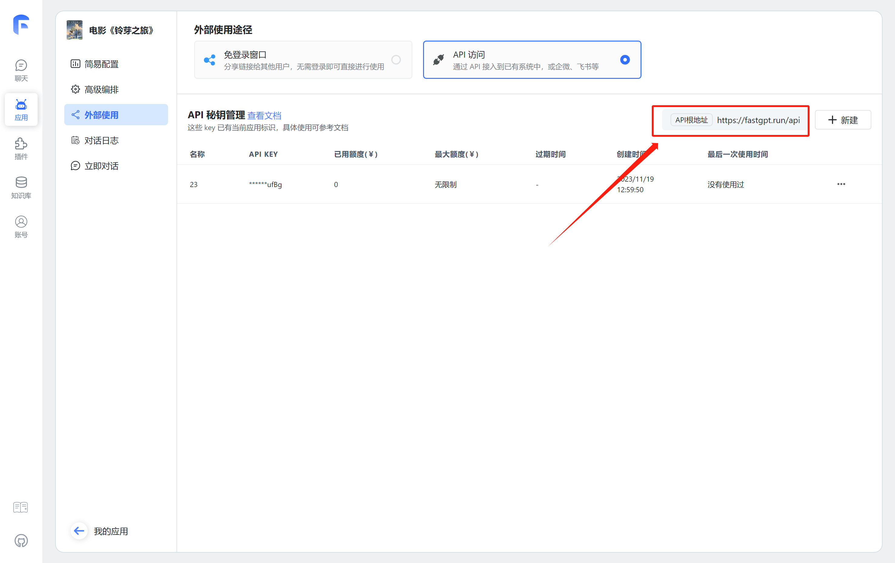
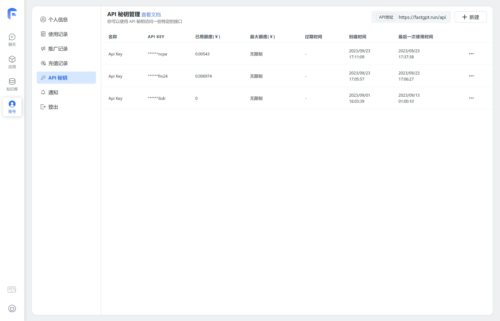
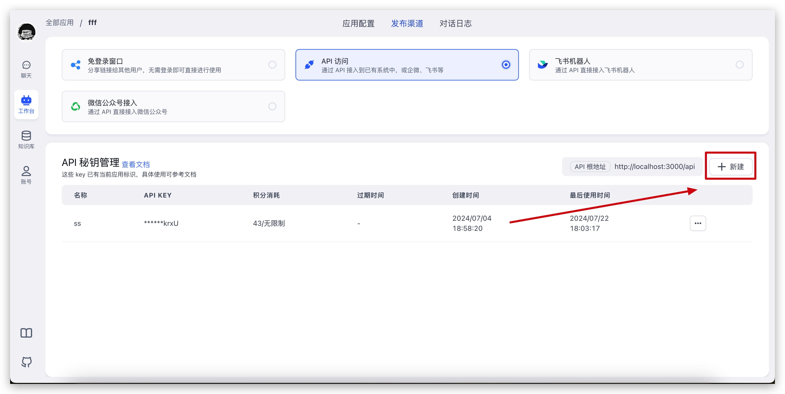

## Automated API Documentation

The automated API documentation covers all endpoints in the current version, regardless of whether they can be called via API Key.

All future endpoints will be auto-generated, with documentation continuously improved.

- [China Mainland API Documentation](https://cloud.fastgpt.cn/openapi)
- [International API Documentation](https://cloud.fastgpt.io/openapi)

## Usage Guide

FastGPT OpenAPI lets you authenticate with an API Key to access FastGPT services and resources -- such as calling app chat endpoints, uploading knowledge base data, search testing, and more. For compatibility and security reasons, not all endpoints support API Key access.

## How to Find Your BaseURL

**Note: BaseURL is not an endpoint address -- it's the root URL for all endpoints. Requesting the BaseURL directly won't work.**



## API Key Types

FastGPT has **two types of API Keys**: **Global API Keys** and **App API Keys**. They are created in different places, have different isolation boundaries, and support different APIs.

| Type           | Where to create it             | Isolation                                        | Typical use                                                                                                                                                                                                                                                           |
| -------------- | ------------------------------ | ------------------------------------------------ | --------------------------------------------------------------------------------------------------------------------------------------------------------------------------------------------------------------------------------------------------------------------- |
| Global API Key | Account settings -> API Keys   | Team-level key that is not bound to a single app | Call general OpenAPI endpoints that support API Key authentication. To call `chat/completions`, pass `appId` in the request body. Since `v4.15.0`, the team owner can enable `authProxy` for the key to proxy a team member identity, and the request body must include `authProxy`. |
| App API Key    | App -> Publish Channels -> API | App-scoped key. Each key belongs to one app only | Call the `chat/completions` endpoint for that app. The key is already bound to the app, so you do not need to pass `appId`. App API Keys do not support `authProxy`.                                                                                                  |

Use an `App API Key` when a third-party client or external system only needs to chat with one app. Use a `Global API Key` for server-side integrations that manage shared resources such as Knowledge Bases or apps, or when `chat/completions` needs `authProxy`.

| Global API Key                          | App API Key                             |
| --------------------------------------- | --------------------------------------- |
|  |  |

## Basic Configuration

In OpenAPI, all endpoints authenticate via Header.Authorization.

```
baseUrl: "http://localhost:3000/api"
headers: {
    Authorization: "Bearer {{apikey}}"
}
```

**Example: Start an App Chat**

```sh
curl --location --request POST 'http://localhost:3000/api/v1/chat/completions' \
--header 'Authorization: Bearer fastgpt-xxxxxx' \
--header 'Content-Type: application/json' \
--data-raw '{
    "chatId": "111",
    "stream": false,
    "detail": false,
    "messages": [
        {
            "content": "Who is the director",
            "role": "user"
        }
    ]
}'
```

## Custom User ID

Since `v4.8.13`, you can pass a custom user ID that will be saved in the chat history.

```sh
curl --location --request POST 'http://localhost:3000/api/v1/chat/completions' \
--header 'Authorization: Bearer fastgpt-xxxxxx' \
--header 'Content-Type: application/json' \
--data-raw '{
    "chatId": "111",
    "stream": false,
    "detail": false,
    "messages": [
        {
            "content": "Who is the director",
            "role": "user"
        }
    ],
    "customUid": "xxxxxx"
}'
```

In the chat history, this record's user will be displayed as `xxxxxx`.
