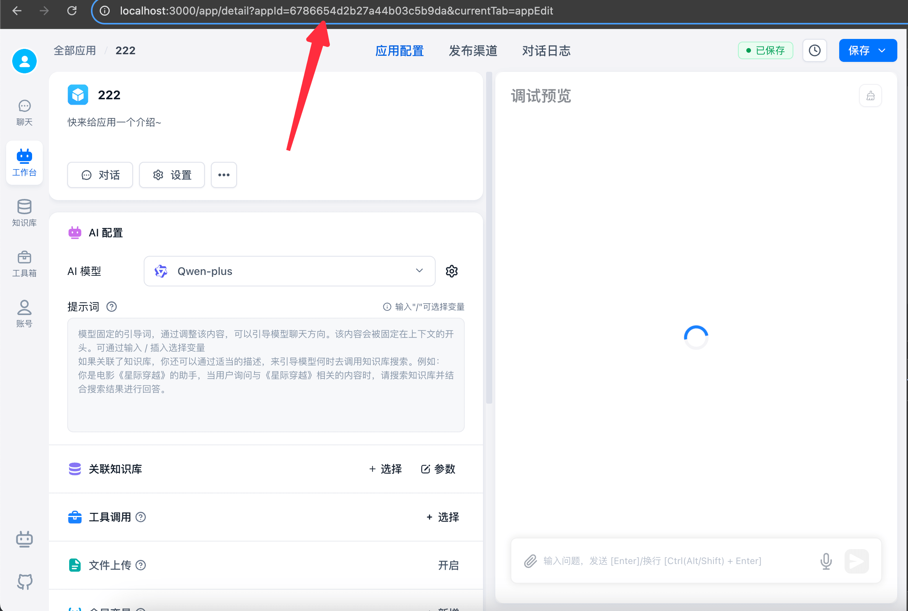
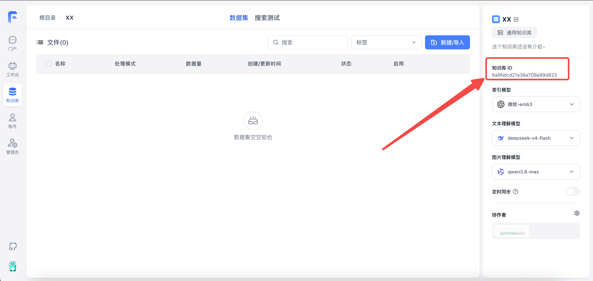
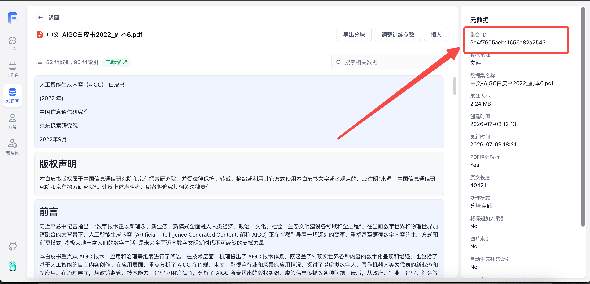

Starting with `4.15.0`, FastGPT API documentation is generated automatically with `zod-openapi`. You can view the latest endpoint status by opening the API documentation URL. The manually edited endpoint descriptions in the left sidebar of this documentation are no longer updated.

FastGPT API documentation is split into two sets:

- Dev API: all development APIs. Not every endpoint can be called with an API Key.
- System OpenAPI: all system public endpoints, callable with a system API Key.

## API Documentation URL

`endpoint` is your FastGPT access URL. Append the corresponding path to open the documentation.

- Dev API: `{{endpoint}}/apidoc/devapi`
- System OpenAPI: `{{endpoint}}/apidoc/systemopenapi`

## Cloud API Documentation URL

**Dev API:**

- [China Mainland documentation](https://cloud.fastgpt.cn/apidoc/devapi)
- [International documentation](https://cloud.fastgpt.io/apidoc/devapi)

**System OpenAPI**

- [China Mainland documentation](https://cloud.fastgpt.cn/apidoc/systemopenapi)
- [International documentation](https://cloud.fastgpt.io/apidoc/systemopenapi)

## Usage Notes

FastGPT OpenAPI endpoints let you authenticate with an API Key to operate related FastGPT services and resources, such as calling app chat endpoints, uploading Dataset data, and running search tests. For compatibility and security reasons, not all endpoints can be accessed with an API Key.

### How to Get an API Key

You can find API Keys in two places:

1. `Account` - `API Keys`
2. `App` - `Publish Channels` - `API Access`

### API Key Scope

An API Key acts as the current account's access credential within the current team. In other words, any resource the account can access in that team can also be operated through the API Key.

### API key usage

- Authenticate with an API Key. When calling `chat/completions`, pass `appId` in the request body whenever possible.
- For OpenAI SDK compatibility, you can also use `Authorization: Bearer <apiKey>-<appId>`. In this case, you can omit `body.appId`.
- The `appId` precedence is: `body.appId` > the `appId` in `<apiKey>-<appId>` > the `appId` associated with the API Key (legacy compatibility).
- Some SDKs require adding `v1` to the `BaseURL`. If you get a 404 error, try adding `v1` and retry.
- To proxy a team member's identity through `authProxy`, the team owner must enable `authProxy` when creating or editing the key. The proxied member must still have permission to access the target app and session. (FastGPT >= v4.15.0)

### How to find the app ID (appId)

Open the app details page and find `appId` in the URL in your browser's address bar.



### How to find Dataset and Collection IDs

| Dataset ID (datasetId)                  | Collection ID (collectionId)               |
| --------------------------------------- | ------------------------------------------ |
|  |  |

### Basic Configuration

In OpenAPI, all endpoints authenticate through `Header.Authorization`.

```
baseUrl: "http://localhost:3000/api"
headers: {
    Authorization: "Bearer {{apikey}}"
}
```
