[SiliconCloud](https://cloud.siliconflow.cn/i/TR9Ym0c4) is a platform focused on open source model inference, with its own acceleration engine. It helps users test and use open source models quickly at low cost. In our experience, their models offer solid speed and stability, with a wide variety covering language, embedding, reranking, TTS, STT, image generation, and video generation — meeting all model requirements in FastGPT.

Before reading this guide, make sure you've read the [Model Configuration Guide](./intro.en.mdx).

## 1. Register an Account

1. [Register a SiliconCloud account](https://cloud.siliconflow.cn/i/TR9Ym0c4)
2. Go to the console and get your API key: https://cloud.siliconflow.cn/account/ak

## 2. Add Models

The system includes a few SiliconCloud models by default for quick testing. If you need additional models, you can [add them manually](./intro.en.mdx#add-a-custom-model).

Here we enable `Qwen2.5 72b` for both text and vision; `bge-m3` as the embedding model; `bge-reranker-v2-m3` as the reranking model; `fish-speech-1.5` as the TTS model; and `SenseVoiceSmall` as the STT model.

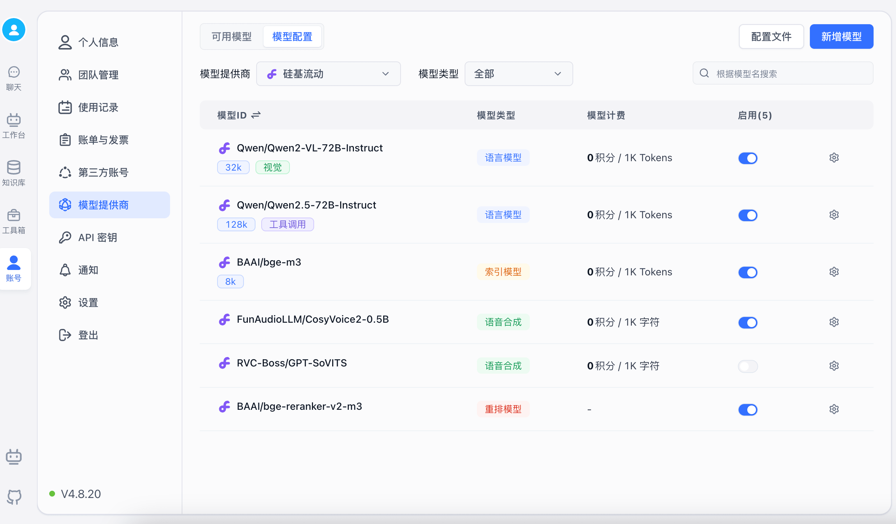

## 3. Add a Model Channel

On the Model Channels page, add a new SiliconCloud channel and select the models you just added.

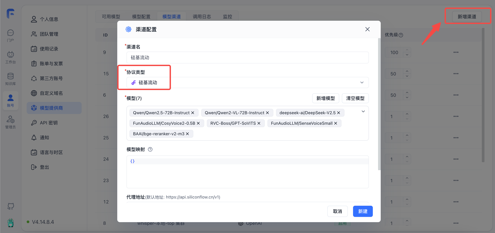

## 4. Test Models

First, verify that all SiliconCloud models are running properly.

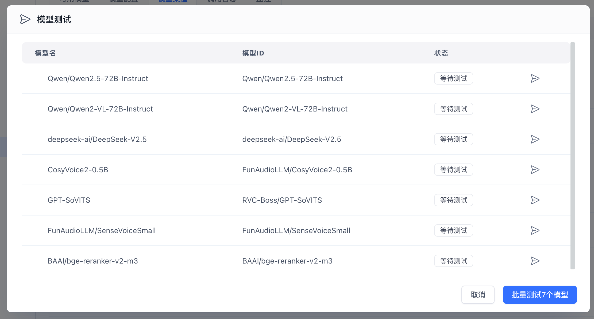

## 5. Test in an App

### Test Chat and Image Recognition

Create a simple app, select the corresponding model, enable image upload, and test:

|                                 |                                 |
| ------------------------------- | ------------------------------- |
| 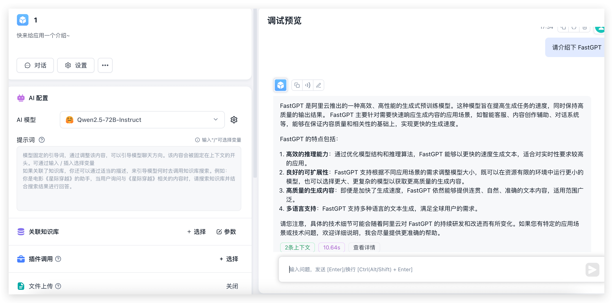 | 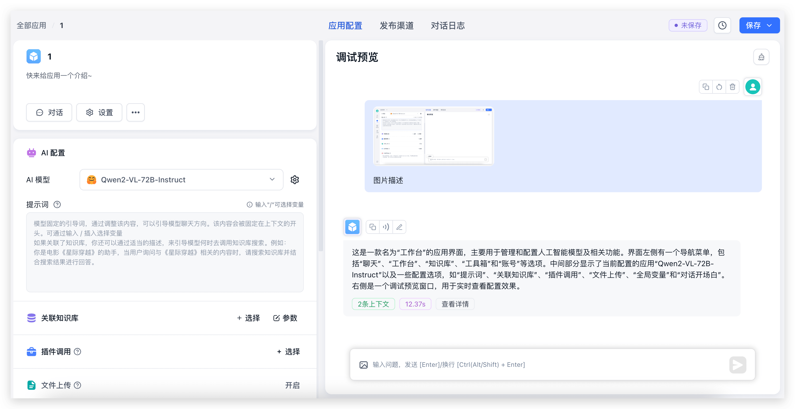 |

The 72B model performs quite fast. Without several 4090 GPUs locally, just the output alone would take around 30 seconds — not to mention the environment setup.

### Test Knowledge Base Import and Q&A

Create a knowledge base (since only one embedding model is configured, the embedding model selector won't appear on the page):

|                                 |                                 |
| ------------------------------- | ------------------------------- |
| 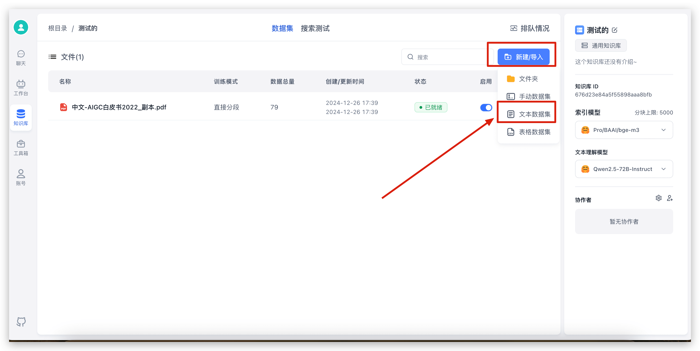 | 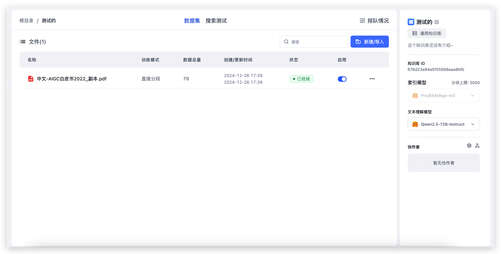 |

Import a local file — just select the file and click through the steps. 79 indexes were completed in about 20 seconds. Now let's test knowledge base Q&A.

Go back to the app we just created, select the knowledge base, adjust the parameters, and start a conversation:

|                                 |                                 |                                 |
| ------------------------------- | ------------------------------- | ------------------------------- |
| 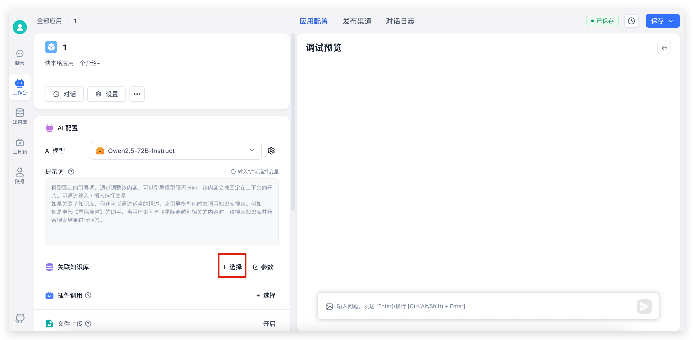 | 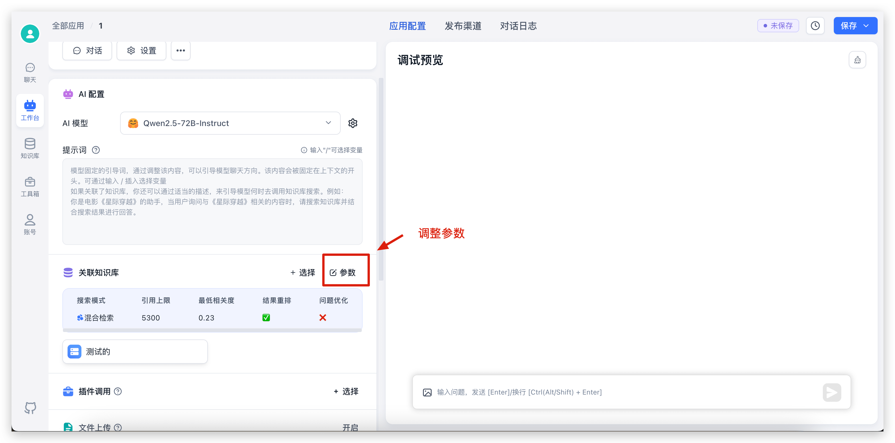 | 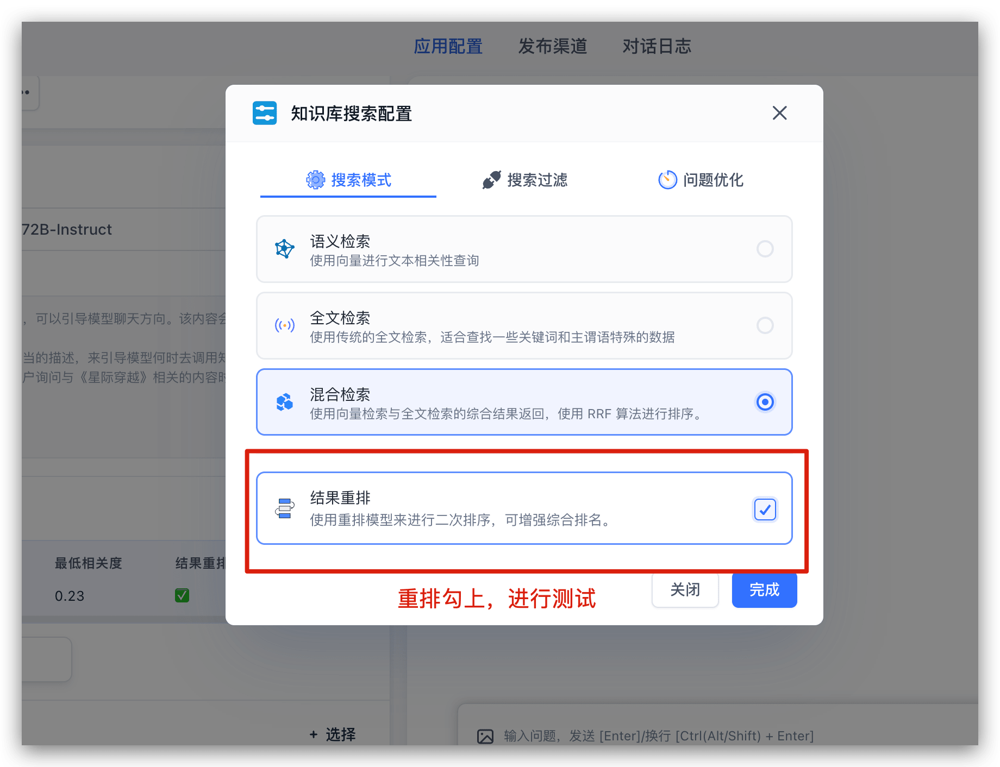 |

After the conversation, click the citation at the bottom to view citation details, including retrieval and reranking scores:

|                                 |                                 |
| ------------------------------- | ------------------------------- |
| 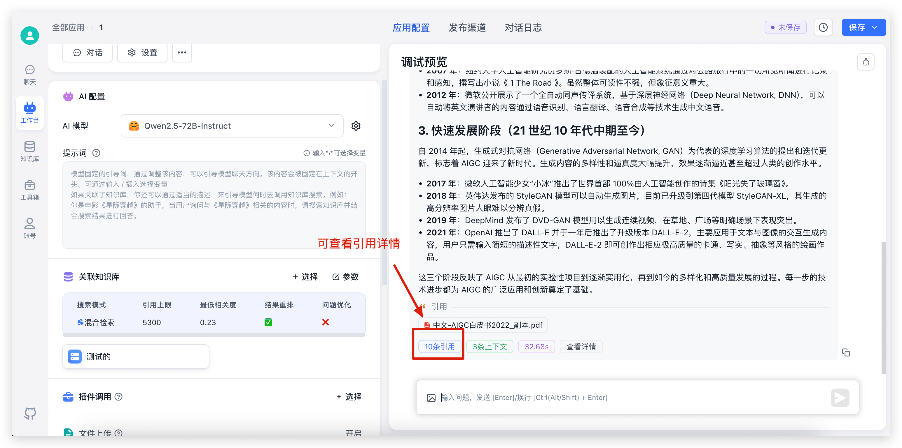 |  |

### Test Text-to-Speech

In the same app, find "Voice Playback" in the left sidebar configuration. Click to select a voice model from the popup and preview it:

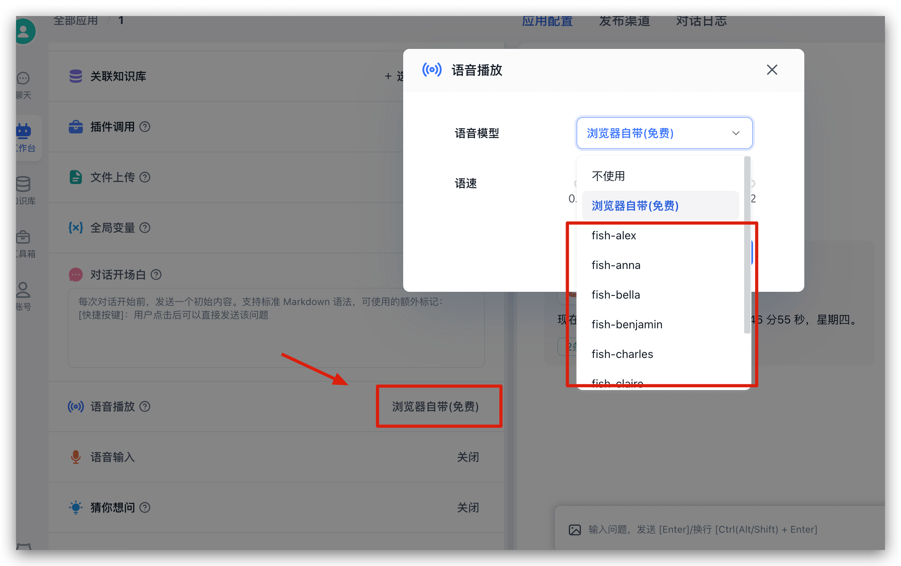

### Test Speech-to-Text

In the same app, find "Voice Input" in the left sidebar configuration. Click to enable voice input from the popup:

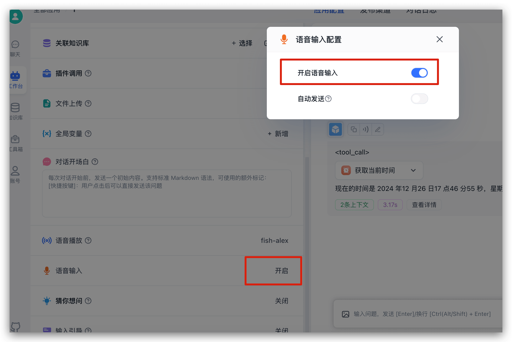

Once enabled, a microphone icon appears in the chat input box. Click it to start voice input:

|                                 |                                 |
| ------------------------------- | ------------------------------- |
| 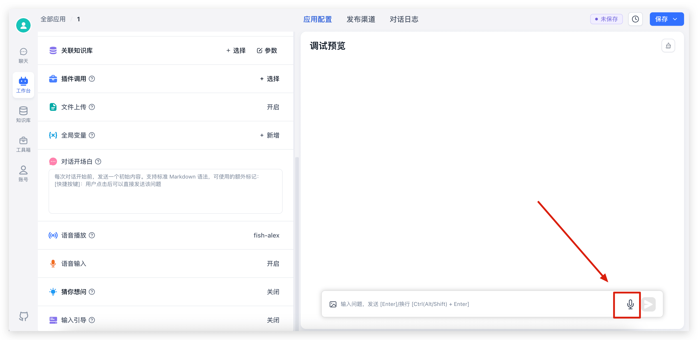 |  |

## Summary

If you want to quickly try open source models or get started with FastGPT without applying for API keys from multiple providers, SiliconCloud is a great option for a fast start.

If you plan to self-host models and FastGPT in the future, you can use SiliconCloud for initial testing and validation, then proceed with hardware procurement later — reducing POC time and cost.
