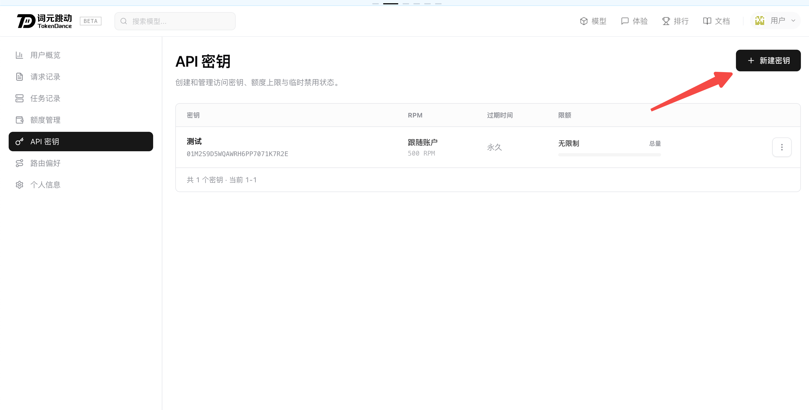
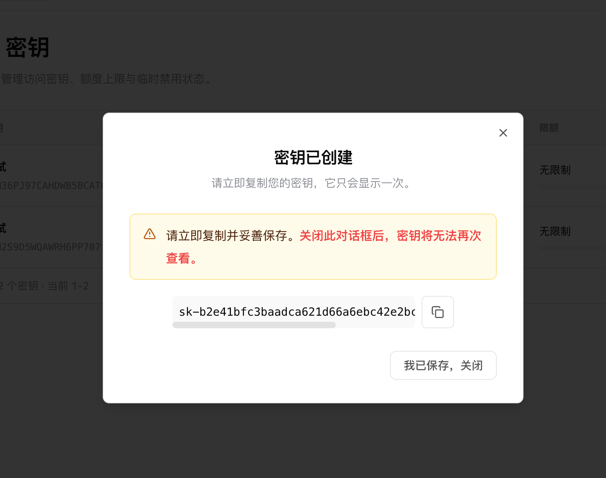
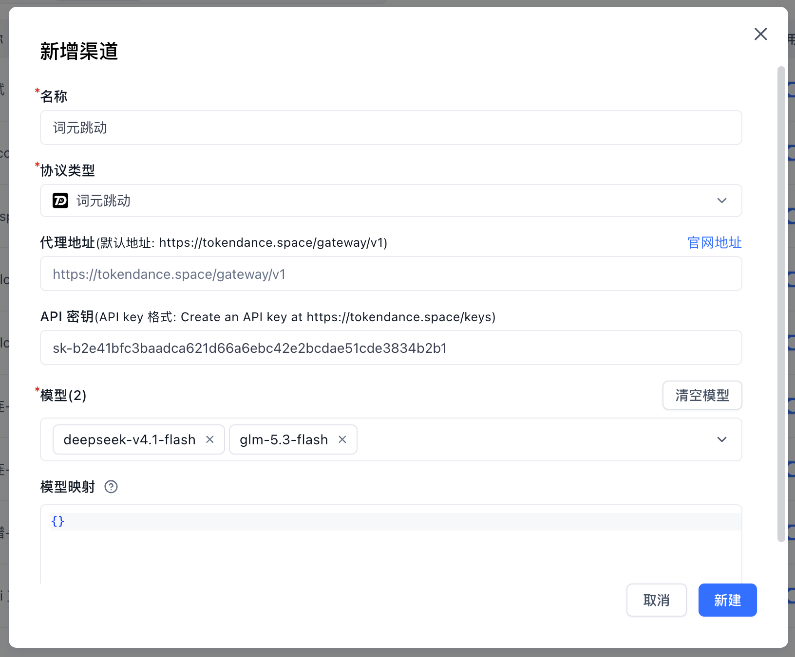
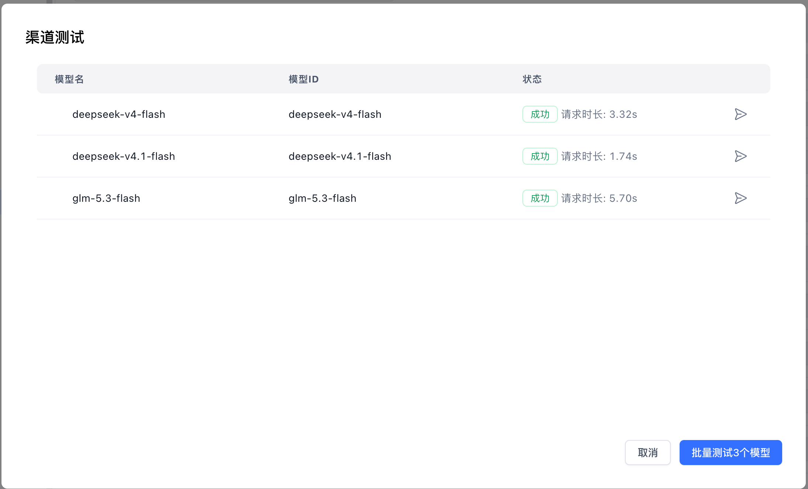
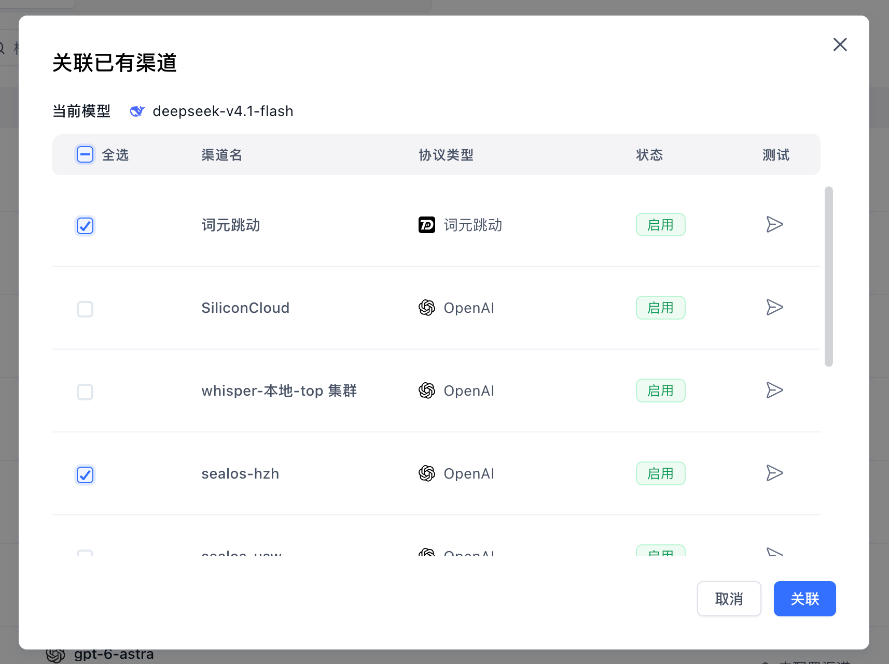

[词元跳动 (TokenDance)](https://tokendance.space/) 是一个统一的 AI API 网关，聚合了众多主流大模型，支持 OpenAI、Anthropic、Google GenAI 等多种接口协议。词元跳动的 API 兼容 OpenAI 格式，可以方便地接入 FastGPT。

在阅读该章之前，请先确保你阅读了[模型配置说明](./intro.mdx)。

## 1. 获取 API Key

1. 访问 [词元跳动控制台](https://tokendance.space/)，注册并登录账号。
2. 前往 [API 密钥管理页面](https://tokendance.space/keys)，点击“新建密钥”。

3. 创建成功后，及时复制并保存生成的 API Key（仅展示一次）。

## 2. 新增模型

系统内置了部分主流模型，如果下拉框中没有想要的选项，可以在 `模型配置` 页面直接启用或[手动添加自定义模型](./intro.mdx#新增自定义模型)。

### 常用模型列表

| 模型 ID               | 上下文 | 最大输出 | 说明                                         |
| --------------------- | ------ | -------- | -------------------------------------------- |
| `deepseek-v4.1-flash` | 1000K  | 8K       | DeepSeek 新一代原生多模态高速模型            |
| `glm-5.3-flash`       | 1000K  | 8K       | 智谱 GLM-5 原生多模态高性价比推理模型        |
| `qwen3-max`           | 256K   | 8K       | 通义千问旗舰模型，针对 RAG 与工具调用优化    |
| `kimi-k2.5`           | 256K   | 8K       | 月之暗面原生多模态大模型，支持视觉与复杂推理 |
| `minimax-m2.7`        | 200K   | 8K       | MiniMax 生产力与自主执行大语言模型           |

> 提示：词元跳动还支持更多主流语言、向量与多模态模型，完整模型列表与详情可参考 [词元跳动模型列表](https://tokendance.space/models)。

## 3. 新增模型渠道

在模型渠道页，点击“新增渠道”并配置词元跳动渠道信息：

- **名称**：自定义名称，例如 `词元跳动`
- **协议类型**：选择 **词元跳动**（或选择 **OpenAI**）
- **代理地址**：默认地址为 `https://tokendance.space/gateway/v1`
- **API 密钥**：填写获取到的词元跳动 API Key
- **模型**：选择已启用或新增的模型（如 `deepseek-v4.1-flash`、`glm-5.3-flash` 等）

## 4. 测试模型

配置完成后，可以在渠道列表中点击测试按钮，进行渠道连通性与模型可用性测试。

## 5. 关联已有渠道

也可以在「模型配置」页面找到对应模型，打开「关联已有渠道」，选择并测试渠道是否正常，确认无误后点击「关联」即可。

