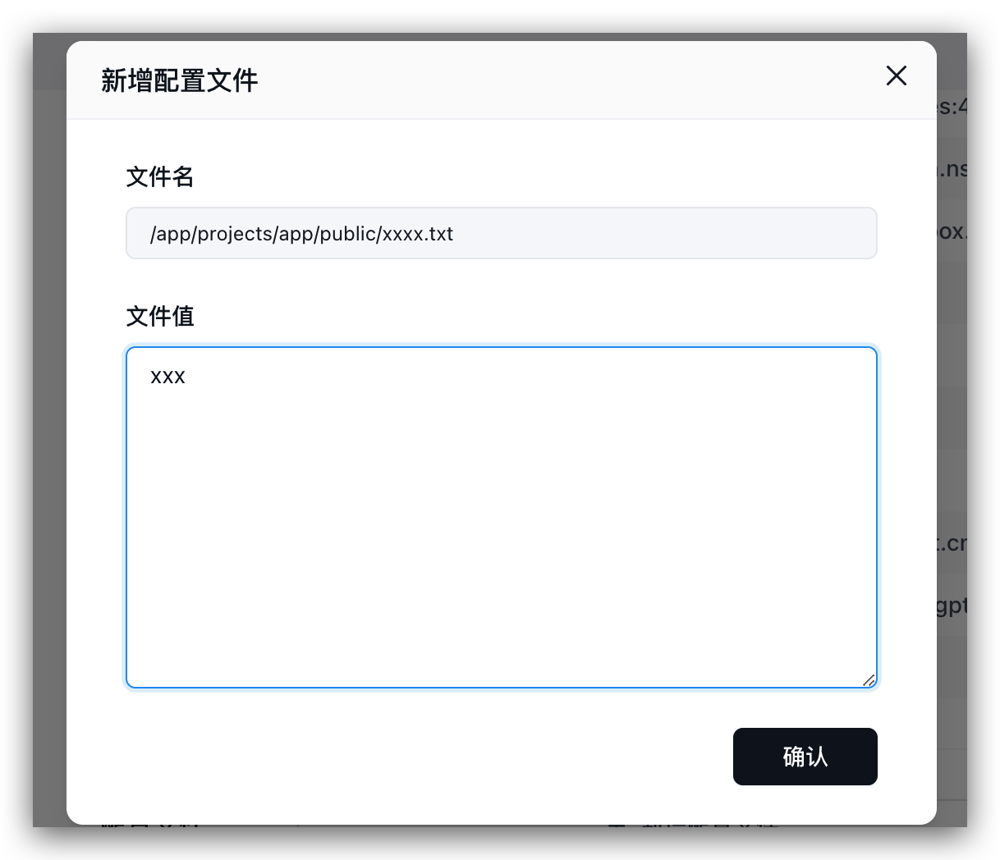
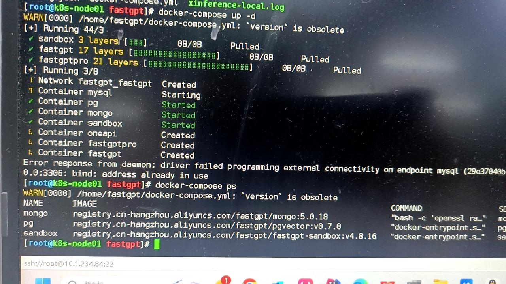

### Frontend Page Crash

1. 90% of cases are due to incorrect model configuration: ensure that at least one model is enabled for each category; check if some `object` parameters in the model are abnormal (arrays and objects). If empty, try giving an empty array or empty object.
2. A small part is due to browser compatibility issues. Since the project contains some high-level syntax, lower version browsers may not be compatible. You can provide specific operation steps and error information in the console to the issue.
3. Turn off the browser translation function. If the browser has translation enabled, it may cause the page to crash.

---

### If deployed via sealos, are there no limitations of local deployment?

This is the length limit of the embedding model. It is the same regardless of the deployment method, but the configuration of different embedding models is different, and parameters can be modified in the background.

---

### How to mount the Mini Program configuration file

Mount the verification file to the specified location: /app/projects/app/public/xxxx.txt

Then restart. For example:

---

### Database port 3306 is occupied, service startup failed

Change the port mapping to 3307 or similar, for example 3307:3306.

---

### Can it run purely locally?

Yes. You need to prepare the vector model and LLM model.

---

### Other models cannot perform question classification/content extraction

1. Check the logs. If it prompts JSON invalid, not support tool, etc., it means that the model does not support tool calling or function calling. You need to set `toolChoice=false` and `functionCall=false`, and it will default to the prompt mode. Currently, the built-in prompts are only tested for commercial model APIs. Question classification is basically usable, but content extraction is not very good.
2. If the configuration is normal and there are no error logs, it means that the prompt may not be suitable for the model. You can customize the prompt by modifying `customCQPrompt`.

---

### Page Crash

1. Turn off translation.
2. Check if the configuration file is loaded normally. If it is not loaded normally, system information will be missing, and it will cause a null pointer in some operations.

- 95% of cases are incorrect configuration files. It will prompt xxx undefined.
- Prompt `URI malformed`, please Issue feedback specific operations and pages, this is due to special string encoding parsing errors.

3. Some api incompatibility issues (rare).

---

### After enabling content completion, the response speed becomes slow

1. Question completion requires a round of AI generation.
2. 3~5 rounds of queries will be performed. If the database performance is insufficient, there will be a significant impact.

---

### Normal reply in the page, API error

The page uses stream=true mode, so the API also needs to set stream=true for testing. Some model interfaces (mostly domestic) are a bit garbage in non-Stream compatibility.
Same as the previous question, curl test.

---

### Dataset indexing has no progress/indexing is very slow

First look at the log error information. There are several situations:

1. Can verify, but indexing has no progress: vector model (vectorModels) is not configured.
2. Cannot verify, nor index: API call failed. Maybe not connected to OneAPI or OpenAI.
3. Has progress, but very slow: api key is not good, OpenAI free account, only 3 times or 60 times a minute. 200 times a day limit.

---

### Connection error

Network exception. Domestic servers cannot request OpenAI, check whether the connection with the AI model is normal.

Or FastGPT cannot request OneAPI (not in the same network).

---

### How to change the root password

Modify the `DEFAULT_ROOT_PSW` environment variable, and then restart FastGPT.

---

### Does FastGPT support OpenAI's Responses API (/v1/responses)?

No (up to 4.17.0); requests return 404. Use `POST /api/v1/chat/completions` to call an app instead; it is compatible with the OpenAI Chat Completions format.

---

### After upgrading, FastGPT fails to start with "index not found (collection=modeldata_v2)"

Applies to: 4.16.2 and later, with Milvus. The log contains `IndexNotExist ... index not found[collection=modeldata_v2]`.

Cause: Starting with 4.16.2, both vector search and full-text search use the `modeldata_v2` collection. If it already exists at startup but lacks the full-text search index, FastGPT reports this error and exits. Why the index is missing has not been confirmed. Milvus must also be 2.5.16 or later.

What to do: before upgrading, follow [Milvus BM25 Full-Text Search Configuration and Migration](/en/self-host/milvus-bm25) to back up and upgrade Milvus, then upgrade FastGPT and migrate the data. If you already see this error, the collection has to be deleted and recreated, which deletes data: back up first and contact technical support. Until the migration finishes, knowledge base search cannot find the old data.

---

### Deploying with docker-compose reports AGENT_SANDBOX_OPENSANDBOX_IMAGE is not configured or AGENT_SANDBOX_PREVIEW_PROXY_URL is wrong

Applies to: 4.16.0 and later. Since 4.16.0 the sandbox image is set only by `AGENT_SANDBOX_OPENSANDBOX_IMAGE`, and `AGENT_SANDBOX_PREVIEW_PROXY_URL` must be configured. Using a 4.15 or earlier docker-compose template with a newer image causes both errors.

What to do: follow [Deploy with Docker Compose](/en/self-host/deploy/docker) and use the one-click script, or manually download the template that matches the image version (for the current version, use the `main` directory; there are no v4.16 or v4.17 directories).

Note: running the one-click script again in a directory that is already deployed regenerates the database passwords and `AES256_SECRET_KEY` and overwrites `docker-compose.yml`. Back up the original file first. To keep your data, choose not to auto-generate passwords (or set `FASTGPT_AUTO_GENERATE_CREDENTIALS=false`) and copy the original passwords and secrets over.

---

### Parallel Run reports parallel_task_not_reach_end, or runs only one task

Applies to: verified against 4.17.0. Parallel Run starts one task per element of the input array. A whole block of multi-line text (for example, one URL per line) is treated as an array with a single element, so only one task runs. `parallel_task_not_reach_end` means the sub-workflow of a task did not reach the End node; if the sub-workflow has a more specific error, that error is shown instead.

What to do: add a Code run node before Parallel Run that splits the text into an array by newline, for example returning `text.split('\n').map(s => s.trim()).filter(Boolean)`, and have the Parallel Run array input reference its result. If it still fails, open the failing task's Run Details and check whether the sub-workflow reached the End node.

---

### Uploading files over HTTPS fails with "s3 upload network error"

Applies to: verified against 4.17.0. The address the browser uploads files to comes from `FILE_DOMAIN`, or from `FE_DOMAIN` if it is not set. If the page uses HTTPS but this address is `http://`, the browser blocks the request as mixed content and it never reaches the server.

What to do: change the matching setting to a reachable https address (`FILE_DOMAIN` if it is set, otherwise `FE_DOMAIN`) and restart. You can confirm in the browser console whether there is a Mixed Content error.

---

### On Windows, FastGPT fails to start in local development because it can't reach the plugin service (localhost:3004)

Applies to: the local development environment (`deploy/dev`). `fastgpt-plugin` runs with host networking on port 3004, and FastGPT exits at startup if it can't reach `http://localhost:3004`. On Windows Docker Desktop, host networking by default only takes effect inside Docker's own virtual machine, so the host cannot reach it.

What to do: in Docker Desktop (version 4.34 or later, signed in), go to Settings → Resources → Network, check Enable host networking, and restart; or develop under WSL2, Linux, or macOS, as the development docs recommend.

---
