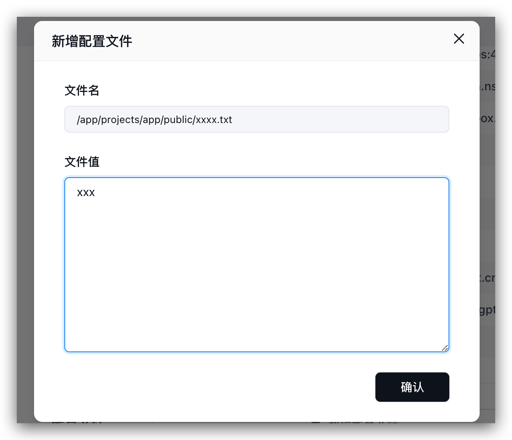
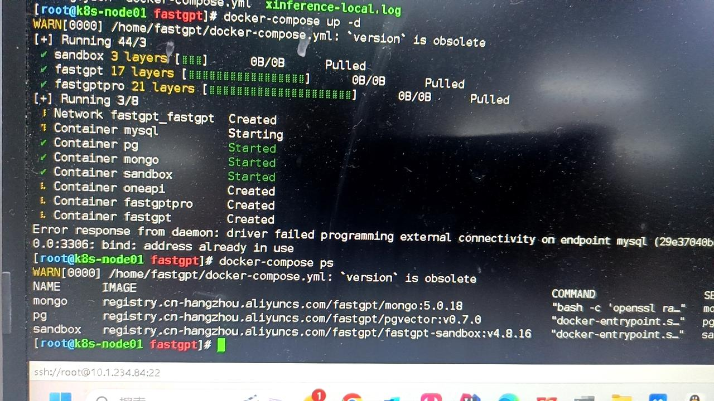

### (1)前端页面崩溃

1. 90% 情况是模型配置不正确：确保每类模型都至少有一个启用；检查模型中一些`对象`参数是否异常（数组和对象），如果为空，可以尝试给个空数组或空对象。
2. 少部分是由于浏览器兼容问题，由于项目中包含一些高阶语法，可能低版本浏览器不兼容，可以将具体操作步骤和控制台中错误信息提供 issue。
3. 关闭浏览器翻译功能，如果浏览器开启了翻译，可能会导致页面崩溃。

---

### (2)通过sealos部署的话，是否没有本地部署的一些限制？

这是索引模型的长度限制，通过任何方式部署都一样的，但不同索引模型的配置不一样，可以在后台修改参数。

---

### (3)怎么挂载小程序配置文件

将验证文件，挂载到指定位置：/app/projects/app/public/xxxx.txt

然后重启。例如:

---

### (4)数据库3306端口被占用了，启动服务失败

把端口映射改成 3307 之类的，例如 3307:3306。

---

### (5)能否纯本地运行

可以。需要准备好向量模型和LLM模型。

---

### (6)其他模型没法进行问题分类/内容提取

1. 看日志。如果提示 JSON invalid，not support tool 之类的，说明该模型不支持工具调用或函数调用，需要设置`toolChoice=false`和`functionCall=false`，就会默认走提示词模式。目前内置提示词仅针对了商业模型API进行测试。问题分类基本可用，内容提取不太行。
2. 如果已经配置正常，并且没有错误日志，则说明可能提示词不太适合该模型，可以通过修改`customCQPrompt`来自定义提示词。

---

### (7)页面崩溃

1. 关闭翻译
2. 检查配置文件是否正常加载，如果没有正常加载会导致缺失系统信息，在某些操作下会导致空指针。

- 95%情况是配置文件不对。会提示 xxx undefined
- 提示`URI malformed`，请 Issue 反馈具体操作和页面，这是由于特殊字符串编码解析报错。

3. 某些api不兼容问题（较少）

---

### (8)开启内容补全后，响应速度变慢

1. 问题补全需要经过一轮AI生成。
2. 会进行3~5轮的查询，如果数据库性能不足，会有明显影响。

---

### (9)页面中可以正常回复，API 报错  

页面中是用 stream=true 模式，所以API也需要设置 stream=true 来进行测试。部分模型接口（国产居多）非 Stream 的兼容有点垃圾。
和上一个问题一样，curl 测试。

---

### (10)知识库索引没有进度/索引很慢

先看日志报错信息。有以下几种情况：

1. 可以对话，但是索引没有进度：没有配置向量模型（vectorModels）
2. 不能对话，也不能索引：API调用失败。可能是没连上OneAPI或OpenAI
3. 有进度，但是非常慢：api key不行，OpenAI的免费号，一分钟只有3次还是60次。一天上限200次。

---

### (11)Connection error

网络异常。国内服务器无法请求OpenAI，自行检查与AI模型的连接是否正常。

或者是FastGPT请求不到 OneAPI（没放同一个网络）

---

### (12)修改了 vectorModels 但是没有生效

1. 重启容器，确保模型配置已经加载（可以在日志或者新建知识库时候看到新模型）
2. 记得刷新一次浏览器。
3. 如果是已经创建的知识库，需要删除重建。向量模型是创建时候绑定的，不会动态更新。

---
