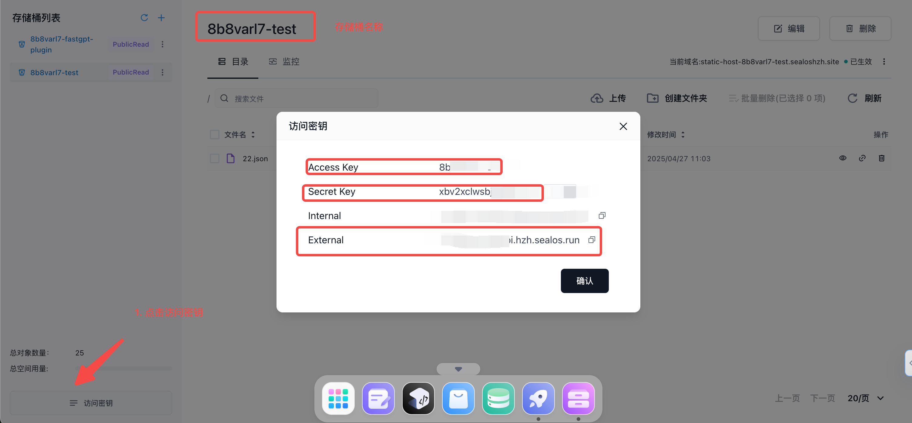

## 更新指南

### Docker 版本

- 参考最新的[docker-compose.yml](https://github.com/labring/FastGPT/blob/main/deploy/docker/docker-compose-pgvector.yml)文件，加入`fastgpt-plugin`和`minio`服务。
- 修改`fastgpt-plugin`环境变量`AUTH_TOKEN`为较复杂的值。
- 修改`fastgpt-plugin`环境变量`MINIO_CUSTOM_ENDPOINT`为`http://ip:port` 或相关域名，要求fastgpt 用户可访问。
- 更新`fastgpt`和`fastgpt-pro`(商业版)容器的环境变量:

```
PLUGIN_BASE_URL=http://fastgpt-plugin:3000
PLUGIN_TOKEN=刚修改的 AUTH_TOKEN 值
```
- 更新`fastgpt`和`fastgpt-pro`镜像 tag: v4.10.0-fix
- `docker-compose up -d`启动/更新所有服务。

### Sealos 版本

- 在 Sealos 桌面的`对象存储`中，新建一个存储桶，设置`publicRead`权限。并获取相关密钥：



- 部署`fastgpt-plugin`服务，镜像`registry.cn-hangzhou.aliyuncs.com/fastgpt/fastgpt-plugin:v0.1.0`，内网暴露端口3000，无需公网访问，设置环境变量:

```
AUTH_TOKEN=鉴权 token

# 日志等级: debug,info,warn,error
LOG_LEVEL=info

# S3 配置
MINIO_CUSTOM_ENDPOINT=External
MINIO_ENDPOINT=Internal地址
MINIO_PORT=80
MINIO_USE_SSL=false
MINIO_ACCESS_KEY=Access Key
MINIO_SECRET_KEY=Secret Key
MINIO_BUCKET=存储桶名
```

- 更新`fastgpt`和`fastgpt-pro`(商业版)容器的环境变量以及镜像 tag: v4.10.0-fix

```
PLUGIN_BASE_URL=fastgpt-plugin 服务的内网地址
PLUGIN_TOKEN=刚修改的 AUTH_TOKEN 值
```

## 🚀 新增内容

1. 独立系统工具服务，支持系统工具独立开发和调试。
2. 更新系统工具开发指南[系统工具开发指南](../../../introduction/guide/plugins/dev_system_tool.mdx)。
3. 更新[系统工具设计文档](../../../introduction/guide/plugins/dev_system_tool.mdx)。
