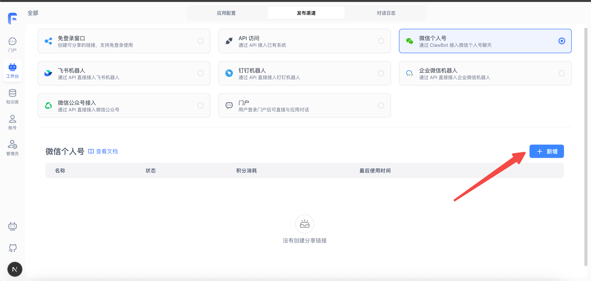
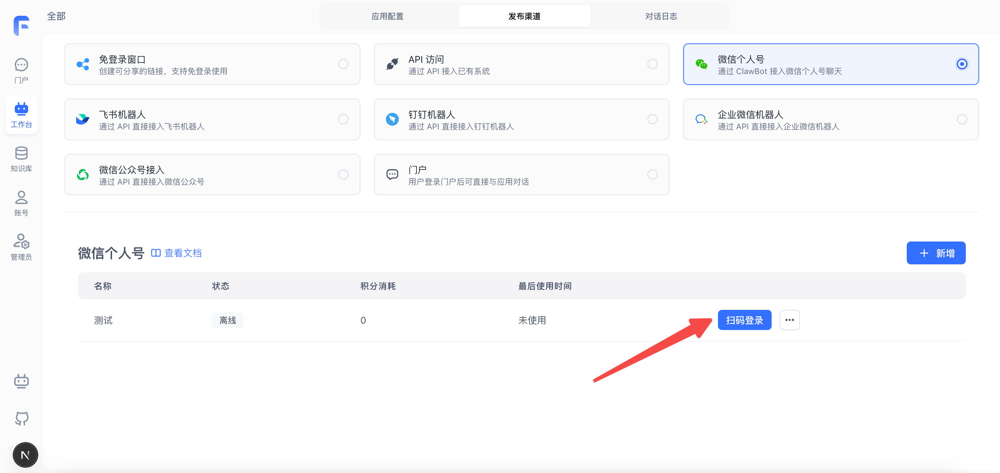
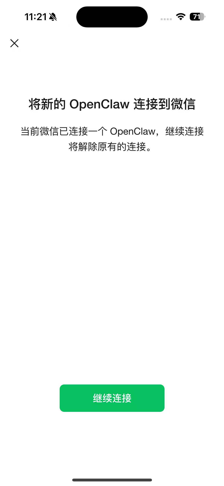
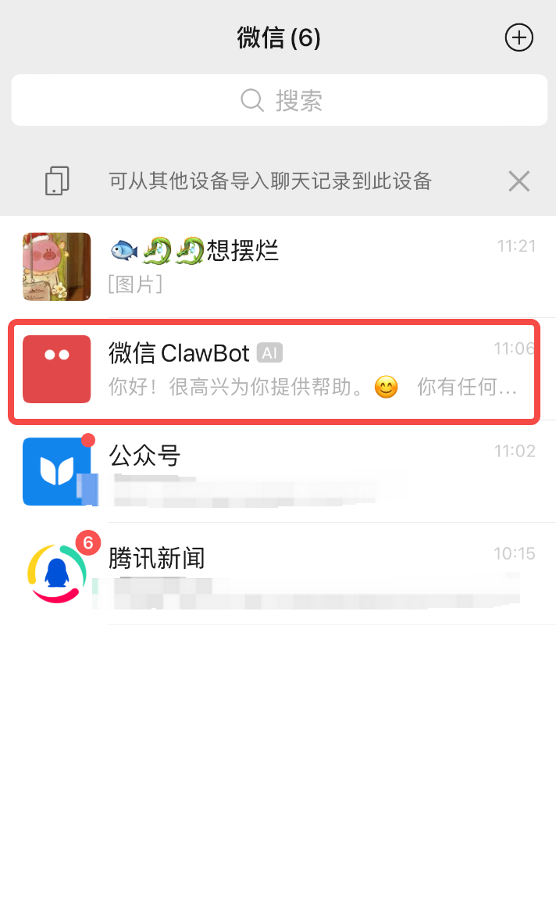
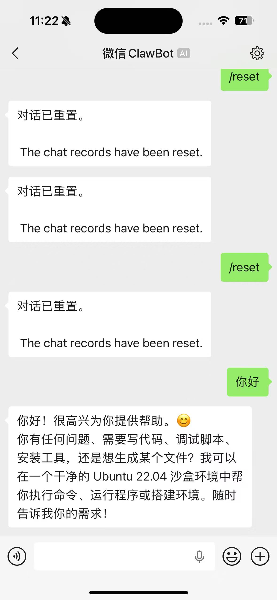

## 1. 新建发布渠道

进入 FastGPT 搭建好的 Agent，点击顶部的 tab 切换到发布渠道，并选择`微信个人号`，点击新建。

表单内容随便填写即可。

## 2. 扫码登录

确认创建渠道后，会多出一条记录，首次需要扫码登录，点击扫码登录，即可跳出登录二维码。

## 3. 愉快玩耍

扫码连接后，好友列表就会多出一个`微信 ClawBot`的机器人可使用。

点击进入后，即可开始聊天啦！

## FAQ

### 微信没找到入口

目前仅支持 IOS 系统，并且需要升级最新版本微信。

### 如何重置聊天

输入框输入：`Reset`或者`/reset` 即可重置聊天记录。