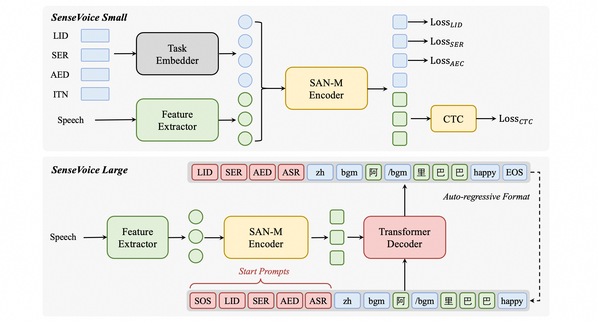
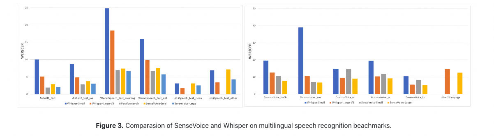
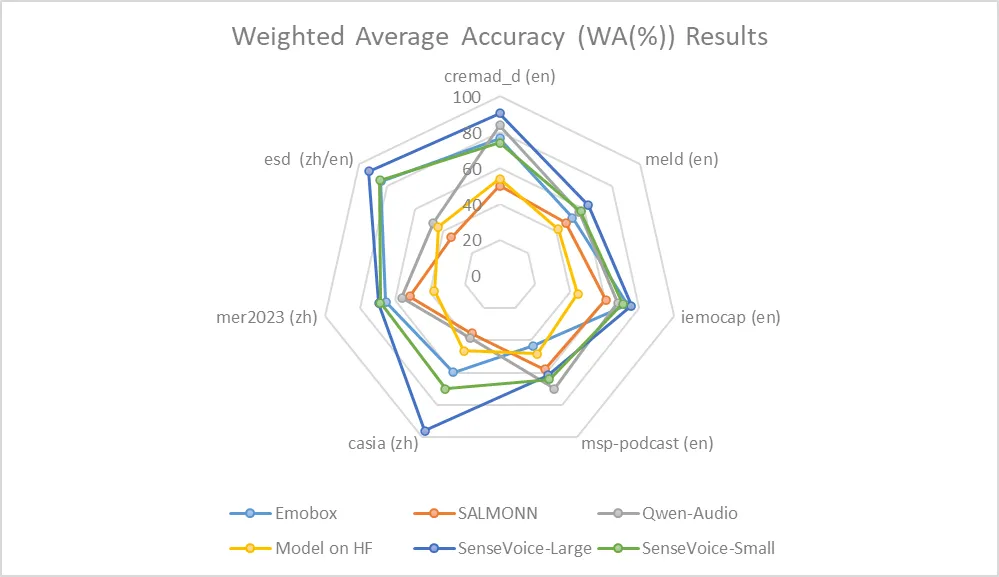
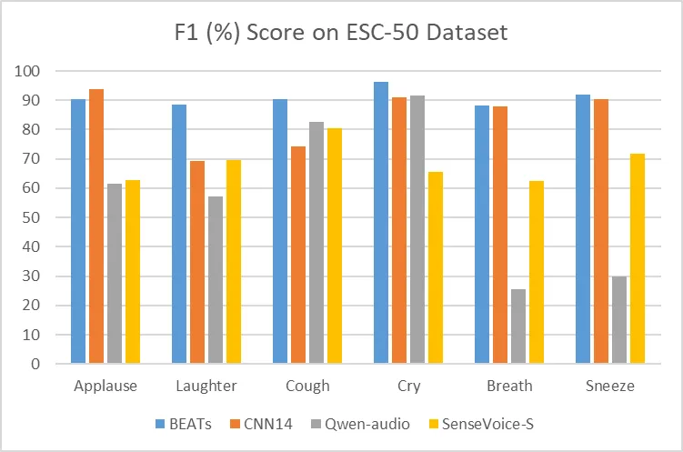

---
frameworks:
- Pytorch
license: Apache License 2.0
tasks:
- auto-speech-recognition

#model-type:
##如 gpt、phi、llama、chatglm、baichuan 等
#- gpt

#domain:
##如 nlp、cv、audio、multi-modal
#- nlp

#language:
##语言代码列表 https://help.aliyun.com/document_detail/215387.html?spm=a2c4g.11186623.0.0.9f8d7467kni6Aa
#- cn 

#metrics:
##如 CIDEr、Blue、ROUGE 等
#- CIDEr

#tags:
##各种自定义，包括 pretrained、fine-tuned、instruction-tuned、RL-tuned 等训练方法和其他
#- pretrained

#tools:
##如 vllm、fastchat、llamacpp、AdaSeq 等
#- vllm
---

# Highlights
**SenseVoice**专注于高精度多语言语音识别、情感辨识和音频事件检测
- **多语言识别：** 采用超过40万小时数据训练，支持超过50种语言，识别效果上优于Whisper模型。
- **富文本识别：** 
  - 具备优秀的情感识别，能够在测试数据上达到和超过目前最佳情感识别模型的效果。
  - 支持声音事件检测能力，支持音乐、掌声、笑声、哭声、咳嗽、喷嚏等多种常见人机交互事件进行检测。
- **高效推理：** SenseVoice-Small模型采用非自回归端到端框架，推理延迟极低，10s音频推理仅耗时70ms，15倍优于Whisper-Large。
- **微调定制：** 具备便捷的微调脚本与策略，方便用户根据业务场景修复长尾样本问题。
- **服务部署：** 具有完整的服务部署链路，支持多并发请求，支持客户端语言有，python、c++、html、java与c#等。


## <strong>[SenseVoice开源项目介绍]()</strong>
<strong>[SenseVoice]()</strong>开源模型是多语言音频理解模型，具有包括语音识别、语种识别、语音情感识别，声学事件检测能力。

[**github仓库**]()
| [**最新动态**]()
| [**环境安装**]()

# 模型结构图
SenseVoice多语言音频理解模型，支持语音识别、语种识别、语音情感识别、声学事件检测、逆文本正则化等能力，采用工业级数十万小时的标注音频进行模型训练，保证了模型的通用识别效果。模型可以被应用于中文、粤语、英语、日语、韩语音频识别，并输出带有情感和事件的富文本转写结果。

<p align="center">

</p>

SenseVoice-Small是基于非自回归端到端框架模型，为了指定任务，我们在语音特征前添加四个嵌入作为输入传递给编码器：
- LID：用于预测音频语种标签。
- SER：用于预测音频情感标签。
- AED：用于预测音频包含的事件标签。
- ITN：用于指定识别输出文本是否进行逆文本正则化。


# 用法

## 推理

### modelscope pipeline推理
```python
from modelscope.pipelines import pipeline
from modelscope.utils.constant import Tasks

inference_pipeline = pipeline(
    task=Tasks.auto_speech_recognition,
    model='iic/SenseVoiceSmall',
    model_revision="master")

rec_result = inference_pipeline('https://isv-data.oss-cn-hangzhou.aliyuncs.com/ics/MaaS/ASR/test_audio/asr_example_zh.wav')
print(rec_result)
```

### 直接推理

```python
from model import SenseVoiceSmall

model_dir = "iic/SenseVoiceSmall"
m, kwargs = SenseVoiceSmall.from_pretrained(model=model_dir)


res = m.inference(
    data_in="https://isv-data.oss-cn-hangzhou.aliyuncs.com/ics/MaaS/ASR/test_audio/asr_example_zh.wav",
    language="auto", # "zn", "en", "yue", "ja", "ko", "nospeech"
    use_itn=False,
    **kwargs,
)

print(res)
```

### 使用funasr推理

```python
from funasr import AutoModel

model_dir = "iic/SenseVoiceSmall"
input_file = (
    "https://isv-data.oss-cn-hangzhou.aliyuncs.com/ics/MaaS/ASR/test_audio/asr_example_zh.wav"
)

model = AutoModel(model=model_dir,
                  vad_model="fsmn-vad",
                  vad_kwargs={"max_single_segment_time": 30000},
                  trust_remote_code=True, device="cuda:0")

res = model.generate(
    input=input_file,
    cache={},
    language="auto", # "zn", "en", "yue", "ja", "ko", "nospeech"
    use_itn=False,
    batch_size_s=0,
)

print(res)
```

funasr版本已经集成了vad模型，支持任意时长音频输入，`batch_size_s`单位为秒。
如果输入均为短音频，并且需要批量化推理，为了加快推理效率，可以移除vad模型，并设置`batch_size`

```python
model = AutoModel(model=model_dir, trust_remote_code=True, device="cuda:0")

res = model.generate(
    input=input_file,
    cache={},
    language="auto", # "zn", "en", "yue", "ja", "ko", "nospeech"
    use_itn=False,
    batch_size=64,
)
```

更多详细用法，请参考 [文档](https://github.com/modelscope/FunASR/blob/main/docs/tutorial/README.md)

## 模型下载


SDK下载
```bash
#安装ModelScope
pip install modelscope
```
```python
#SDK模型下载
from modelscope import snapshot_download
model_dir = snapshot_download('iic/SenseVoiceSmall')
```
Git下载
```
#Git模型下载
git clone https://www.modelscope.cn/iic/SenseVoiceSmall.git
```

## 服务部署

Undo

# Performance

## 语音识别效果
我们在开源基准数据集（包括 AISHELL-1、AISHELL-2、Wenetspeech、Librispeech和Common Voice）上比较了SenseVoice与Whisper的多语言语音识别性能和推理效率。在中文和粤语识别效果上，SenseVoice-Small模型具有明显的效果优势。

<p align="center">

</p>


## 情感识别效果
由于目前缺乏被广泛使用的情感识别测试指标和方法，我们在多个测试集的多种指标进行测试，并与近年来Benchmark上的多个结果进行了全面的对比。所选取的测试集同时包含中文/英文两种语言以及表演、影视剧、自然对话等多种风格的数据，在不进行目标数据微调的前提下，SenseVoice能够在测试数据上达到和超过目前最佳情感识别模型的效果。

<p align="center">

</p>

同时，我们还在测试集上对多个开源情感识别模型进行对比，结果表明，SenseVoice-Large模型可以在几乎所有数据上都达到了最佳效果，而SenseVoice-Small模型同样可以在多数数据集上取得超越其他开源模型的效果。

<p align="center">

</p>

## 事件检测效果

尽管SenseVoice只在语音数据上进行训练，它仍然可以作为事件检测模型进行单独使用。我们在环境音分类ESC-50数据集上与目前业内广泛使用的BEATS与PANN模型的效果进行了对比。SenseVoice模型能够在这些任务上取得较好的效果，但受限于训练数据与训练方式，其事件分类效果专业的事件检测模型相比仍然有一定的差距。

<p align="center">

</p>


## 推理效率
SenseVoice-Small模型采用非自回归端到端架构，推理延迟极低。在参数量与Whisper-Small模型相当的情况下，比Whisper-Small模型推理速度快7倍，比Whisper-Large模型快17倍。同时SenseVoice-small模型在音频时长增加的情况下，推理耗时也无明显增加。


<p align="center">

</p>

<p style="color: lightgrey;">如果您是本模型的贡献者，我们邀请您根据<a href="https://modelscope.cn/docs/ModelScope%E6%A8%A1%E5%9E%8B%E6%8E%A5%E5%85%A5%E6%B5%81%E7%A8%8B%E6%A6%82%E8%A7%88" style="color: lightgrey; text-decoration: underline;">模型贡献文档</a>，及时完善模型卡片内容。</p>
