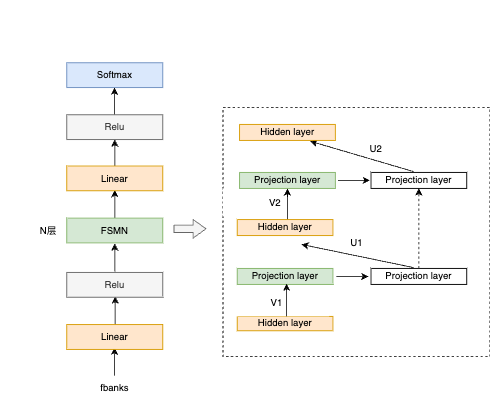

---
tasks:
- voice-activity-detection
domain:
- audio
model-type:
- VAD model
frameworks:
- pytorch
backbone:
- fsmn
metrics:
- f1_score
license: Apache License 2.0
language: 
- cn
tags:
- FunASR
- FSMN
- Alibaba
- Online
datasets:
  train:
  - 20,000 hour industrial Mandarin task
  test:
  - 20,000 hour industrial Mandarin task
widgets:
  - task: voice-activity-detection
    model_revision: v2.0.4
    inputs:
      - type: audio
        name: input
        title: 音频
    examples:
      - name: 1
        title: 示例1
        inputs:
          - name: input
            data: git://example/vad_example.wav 
    inferencespec:
      cpu: 1 #CPU数量
      memory: 4096
---

# FSMN-Monophone VAD 模型介绍

[//]: # (FSMN-Monophone VAD 模型)

## Highlight
- 16k中文通用VAD模型：可用于检测长语音片段中有效语音的起止时间点。
  - 基于[Paraformer-large长音频模型](https://www.modelscope.cn/models/damo/speech_paraformer-large-vad-punc_asr_nat-zh-cn-16k-common-vocab8404-pytorch/summary)场景的使用
  - 基于[FunASR框架](https://github.com/alibaba-damo-academy/FunASR)，可进行ASR，VAD，[中文标点](https://www.modelscope.cn/models/damo/punc_ct-transformer_zh-cn-common-vocab272727-pytorch/summary)的自由组合
  - 基于音频数据的有效语音片段起止时间点检测

## <strong>[FunASR开源项目介绍](https://github.com/alibaba-damo-academy/FunASR)</strong>
<strong>[FunASR](https://github.com/alibaba-damo-academy/FunASR)</strong>希望在语音识别的学术研究和工业应用之间架起一座桥梁。通过发布工业级语音识别模型的训练和微调，研究人员和开发人员可以更方便地进行语音识别模型的研究和生产，并推动语音识别生态的发展。让语音识别更有趣！

[**github仓库**](https://github.com/alibaba-damo-academy/FunASR)
| [**最新动态**](https://github.com/alibaba-damo-academy/FunASR#whats-new) 
| [**环境安装**](https://github.com/alibaba-damo-academy/FunASR#installation)
| [**服务部署**](https://www.funasr.com)
| [**模型库**](https://github.com/alibaba-damo-academy/FunASR/tree/main/model_zoo)
| [**联系我们**](https://github.com/alibaba-damo-academy/FunASR#contact)


## 模型原理介绍

FSMN-Monophone VAD是达摩院语音团队提出的高效语音端点检测模型，用于检测输入音频中有效语音的起止时间点信息，并将检测出来的有效音频片段输入识别引擎进行识别，减少无效语音带来的识别错误。

<p align="center">


FSMN-Monophone VAD模型结构如上图所示：模型结构层面，FSMN模型结构建模时可考虑上下文信息，训练和推理速度快，且时延可控；同时根据VAD模型size以及低时延的要求，对FSMN的网络结构、右看帧数进行了适配。在建模单元层面，speech信息比较丰富，仅用单类来表征学习能力有限，我们将单一speech类升级为Monophone。建模单元细分，可以避免参数平均，抽象学习能力增强，区分性更好。

## 基于ModelScope进行推理

- 推理支持音频格式如下：
  - wav文件路径，例如：data/test/audios/vad_example.wav
  - wav文件url，例如：https://isv-data.oss-cn-hangzhou.aliyuncs.com/ics/MaaS/ASR/test_audio/vad_example.wav
  - wav二进制数据，格式bytes，例如：用户直接从文件里读出bytes数据或者是麦克风录出bytes数据。
  - 已解析的audio音频，例如：audio, rate = soundfile.read("vad_example_zh.wav")，类型为numpy.ndarray或者torch.Tensor。
  - wav.scp文件，需符合如下要求：

```sh
cat wav.scp
vad_example1  data/test/audios/vad_example1.wav
vad_example2  data/test/audios/vad_example2.wav
...
```

- 若输入格式wav文件url，api调用方式可参考如下范例：

```python
from modelscope.pipelines import pipeline
from modelscope.utils.constant import Tasks

inference_pipeline = pipeline(
    task=Tasks.voice_activity_detection,
    model='iic/speech_fsmn_vad_zh-cn-16k-common-pytorch',
    model_revision="v2.0.4",
)

segments_result = inference_pipeline(input='https://isv-data.oss-cn-hangzhou.aliyuncs.com/ics/MaaS/ASR/test_audio/vad_example.wav')
print(segments_result)
```

- 输入音频为pcm格式，调用api时需要传入音频采样率参数fs，例如：

```python
segments_result = inference_pipeline(input='https://isv-data.oss-cn-hangzhou.aliyuncs.com/ics/MaaS/ASR/test_audio/vad_example.pcm', fs=16000)
```

- 若输入格式为文件wav.scp(注：文件名需要以.scp结尾)，可添加 output_dir 参数将识别结果写入文件中，参考示例如下：

```python
inference_pipeline(input="wav.scp", output_dir='./output_dir')
```
识别结果输出路径结构如下：

```sh
tree output_dir/
output_dir/
└── 1best_recog
    └── text

1 directory, 1 files
```
text：VAD检测语音起止时间点结果文件（单位：ms）

- 若输入音频为已解析的audio音频，api调用方式可参考如下范例：

```python
import soundfile

waveform, sample_rate = soundfile.read("vad_example_zh.wav")
segments_result = inference_pipeline(input=waveform)
print(segments_result)
```

- VAD常用参数调整说明（参考：vad.yaml文件）：
  - max_end_silence_time：尾部连续检测到多长时间静音进行尾点判停，参数范围500ms～6000ms，默认值800ms(该值过低容易出现语音提前截断的情况)。
  - speech_noise_thres：speech的得分减去noise的得分大于此值则判断为speech，参数范围：（-1,1）
    - 取值越趋于-1，噪音被误判定为语音的概率越大，FA越高
    - 取值越趋于+1，语音被误判定为噪音的概率越大，Pmiss越高
    - 通常情况下，该值会根据当前模型在长语音测试集上的效果取balance
    


## 基于FunASR进行推理

下面为快速上手教程，测试音频（[中文](https://isv-data.oss-cn-hangzhou.aliyuncs.com/ics/MaaS/ASR/test_audio/vad_example.wav)，[英文](https://isv-data.oss-cn-hangzhou.aliyuncs.com/ics/MaaS/ASR/test_audio/asr_example_en.wav)）

### 可执行命令行
在命令行终端执行：

```shell
funasr ++model=paraformer-zh ++vad_model="fsmn-vad" ++punc_model="ct-punc" ++input=vad_example.wav
```

注：支持单条音频文件识别，也支持文件列表，列表为kaldi风格wav.scp：`wav_id   wav_path`

### python示例
#### 非实时语音识别
```python
from funasr import AutoModel
# paraformer-zh is a multi-functional asr model
# use vad, punc, spk or not as you need
model = AutoModel(model="paraformer-zh", model_revision="v2.0.4",
                  vad_model="fsmn-vad", vad_model_revision="v2.0.4",
                  punc_model="ct-punc-c", punc_model_revision="v2.0.4",
                  # spk_model="cam++", spk_model_revision="v2.0.2",
                  )
res = model.generate(input=f"{model.model_path}/example/asr_example.wav", 
            batch_size_s=300, 
            hotword='魔搭')
print(res)
```
注：`model_hub`：表示模型仓库，`ms`为选择modelscope下载，`hf`为选择huggingface下载。

#### 实时语音识别

```python
from funasr import AutoModel

chunk_size = [0, 10, 5] #[0, 10, 5] 600ms, [0, 8, 4] 480ms
encoder_chunk_look_back = 4 #number of chunks to lookback for encoder self-attention
decoder_chunk_look_back = 1 #number of encoder chunks to lookback for decoder cross-attention

model = AutoModel(model="paraformer-zh-streaming", model_revision="v2.0.4")

import soundfile
import os

wav_file = os.path.join(model.model_path, "example/asr_example.wav")
speech, sample_rate = soundfile.read(wav_file)
chunk_stride = chunk_size[1] * 960 # 600ms

cache = {}
total_chunk_num = int(len((speech)-1)/chunk_stride+1)
for i in range(total_chunk_num):
    speech_chunk = speech[i*chunk_stride:(i+1)*chunk_stride]
    is_final = i == total_chunk_num - 1
    res = model.generate(input=speech_chunk, cache=cache, is_final=is_final, chunk_size=chunk_size, encoder_chunk_look_back=encoder_chunk_look_back, decoder_chunk_look_back=decoder_chunk_look_back)
    print(res)
```

注：`chunk_size`为流式延时配置，`[0,10,5]`表示上屏实时出字粒度为`10*60=600ms`，未来信息为`5*60=300ms`。每次推理输入为`600ms`（采样点数为`16000*0.6=960`），输出为对应文字，最后一个语音片段输入需要设置`is_final=True`来强制输出最后一个字。

#### 语音端点检测（非实时）
```python
from funasr import AutoModel

model = AutoModel(model="fsmn-vad", model_revision="v2.0.4")

wav_file = f"{model.model_path}/example/asr_example.wav"
res = model.generate(input=wav_file)
print(res)
```

#### 语音端点检测（实时）
```python
from funasr import AutoModel

chunk_size = 200 # ms
model = AutoModel(model="fsmn-vad", model_revision="v2.0.4")

import soundfile

wav_file = f"{model.model_path}/example/vad_example.wav"
speech, sample_rate = soundfile.read(wav_file)
chunk_stride = int(chunk_size * sample_rate / 1000)

cache = {}
total_chunk_num = int(len((speech)-1)/chunk_stride+1)
for i in range(total_chunk_num):
    speech_chunk = speech[i*chunk_stride:(i+1)*chunk_stride]
    is_final = i == total_chunk_num - 1
    res = model.generate(input=speech_chunk, cache=cache, is_final=is_final, chunk_size=chunk_size)
    if len(res[0]["value"]):
        print(res)
```

#### 标点恢复
```python
from funasr import AutoModel

model = AutoModel(model="ct-punc", model_revision="v2.0.4")

res = model.generate(input="那今天的会就到这里吧 happy new year 明年见")
print(res)
```

#### 时间戳预测
```python
from funasr import AutoModel

model = AutoModel(model="fa-zh", model_revision="v2.0.4")

wav_file = f"{model.model_path}/example/asr_example.wav"
text_file = f"{model.model_path}/example/text.txt"
res = model.generate(input=(wav_file, text_file), data_type=("sound", "text"))
print(res)
```

更多详细用法（[示例](https://github.com/alibaba-damo-academy/FunASR/tree/main/examples/industrial_data_pretraining)）


## 微调

详细用法（[示例](https://github.com/alibaba-damo-academy/FunASR/tree/main/examples/industrial_data_pretraining)）


## 使用方式以及适用范围

运行范围
- 支持Linux-x86_64、Mac和Windows运行。

使用方式
- 直接推理：可以直接对长语音数据进行计算，有效语音片段的起止时间点信息（单位：ms）。

## 相关论文以及引用信息

```BibTeX
@inproceedings{zhang2018deep,
  title={Deep-FSMN for large vocabulary continuous speech recognition},
  author={Zhang, Shiliang and Lei, Ming and Yan, Zhijie and Dai, Lirong},
  booktitle={2018 IEEE International Conference on Acoustics, Speech and Signal Processing (ICASSP)},
  pages={5869--5873},
  year={2018},
  organization={IEEE}
}
```
